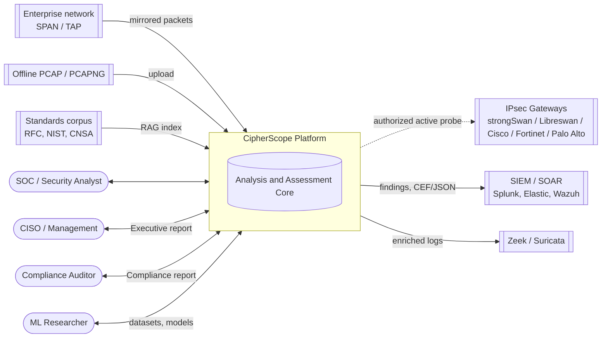
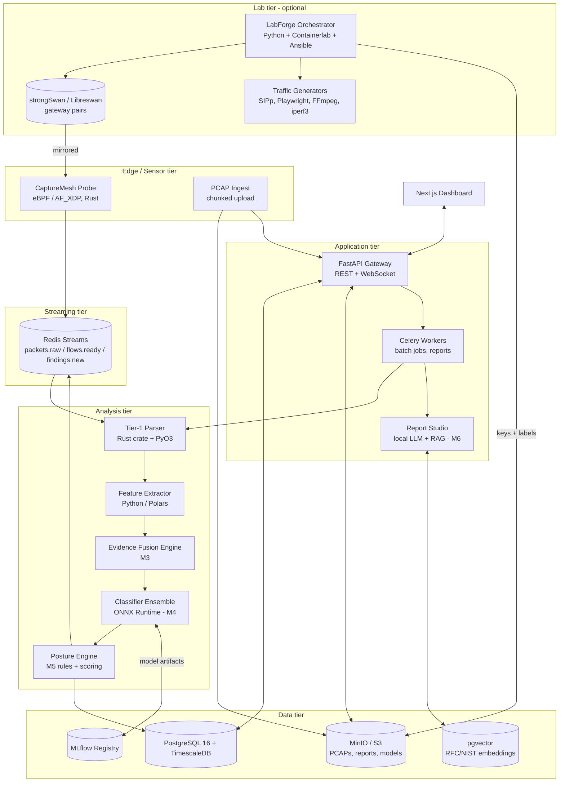
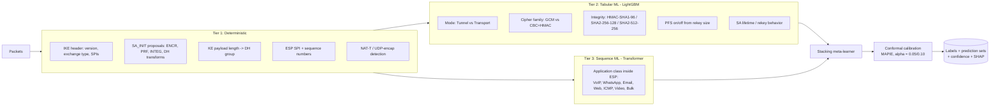
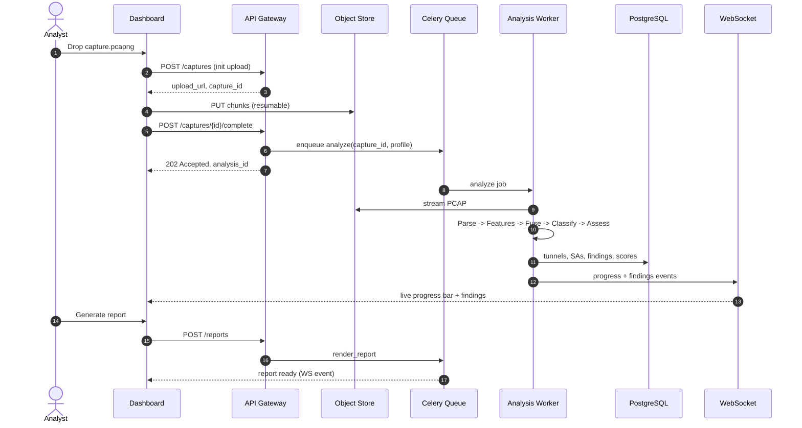
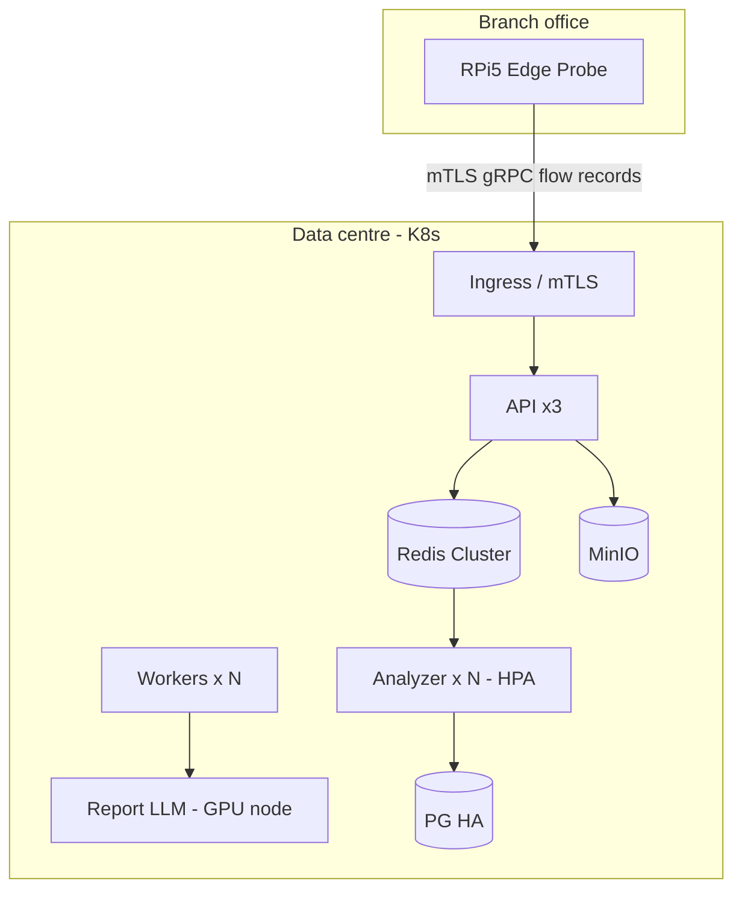

# CipherScope: Architecture and High-Level Design (HLD)

**Status:** Proposed, v1.0
**Audience:** Architects, reviewers, and module leads
**Related:** [LOW_LEVEL_DESIGN.md](./LOW_LEVEL_DESIGN.md) · [MODULES.md](./MODULES.md) · [API_REFERENCE.md](./API_REFERENCE.md)

---

## 1. Goals and non-goals

### 1.1 Goals

1. **Passive-first analysis.** Infer IPsec posture from traffic alone (PCAP or live), without device credentials or configuration files.
2. **Self-labeling data.** Generate large, perfectly labeled datasets from a reproducible testbed.
3. **Explainable AI.** Every inferred label carries a calibrated confidence and human-readable evidence.
4. **Auditable scoring.** The risk score is a published formula, not an opaque model output.
5. **Actionable reporting.** Automatic Executive and Technical reports in which every claim is grounded in evidence or standards text.
6. **Air-gap capable.** The whole stack, including the LLM, runs on-premises with no outbound network access.
7. **Future-proof.** Post-quantum readiness checks (RFC 9370 hybrid KE, ML-KEM / FIPS 203, CNSA 2.0).

### 1.2 Non-goals

- Breaking or brute-forcing IPsec cryptography. CipherScope never attempts cryptanalysis.
- Acting as an inline VPN gateway or firewall. It only observes.
- Unauthorized active scanning. Active-probe mode requires explicit, logged authorization.
- Replacing a full NDR/IDS. CipherScope exports to Zeek, Suricata, and SIEM tools instead.

---

## 2. System context (C4 level 1)



### 2.1 Actors

| Actor | Primary use |
|---|---|
| SOC analyst | Upload PCAPs, watch live tunnels, triage findings, drill into evidence |
| CISO / management | Read Executive reports, estate-wide score and trend |
| Auditor | Check compliance packs (NIST SP 800-77r1, RFC 8221/8247, CNSA 2.0, CERT-In) |
| Network engineer | Apply the remediation playbooks (cipher changes, PFS, lifetimes, TFC) |
| ML researcher | Generate datasets in LabForge, train and evaluate models, publish model versions |

---

## 3. Container view (C4 level 2)



### 3.1 Container responsibilities

| Container | Technology | Responsibility | Scales by |
|---|---|---|---|
| CaptureMesh Probe | Rust, libbpf, AF_XDP | Line-rate capture, BPF filter to IKE/ESP/AH/NAT-T, flow tagging, ring buffers | NIC queues, one probe per mirror port |
| PCAP Ingest | FastAPI + tus/chunked | Resumable upload, checksum, dedupe, store to object store | Stateless replicas |
| LabForge | Python, Containerlab, Ansible, Docker | Build configuration matrix, bring up gateways, drive traffic, export keys, label captures | Parallel lab pods |
| Redis Streams | Redis 7 | Durable, ordered, back-pressured pipeline between stages | Stream sharding by tunnel hash |
| Tier-1 Parser | Rust (`nom`), PyO3 bindings | Zero-copy IKEv1/IKEv2/ESP/AH/NAT-T parsing | CPU cores |
| Feature Extractor | Python 3.12, Polars, NumPy | Flow/SA/sequence features, ESP length algebra, rekey side-channels | Worker count |
| Evidence Fusion | Python | Merge passive, active, and key-assisted evidence, resolve conflicts, attach provenance | Worker count |
| Classifier Ensemble | ONNX Runtime (CPU/GPU) | GBDT + Transformer + stacking + conformal calibration | Replicas; optional GPU |
| Posture Engine | Python, OPA-style YAML rules | Rule evaluation, compliance packs, scoring, threat matrix | Stateless |
| API Gateway | FastAPI, Pydantic v2, Uvicorn | AuthN/Z, REST, WebSocket fan-out, OpenAPI | Stateless replicas |
| Workers | Celery + Redis broker | Offline PCAP jobs, report rendering, dataset builds | Queue depth |
| Report Studio | Ollama (Llama 3.x / Qwen 2.5), LlamaIndex, WeasyPrint | Grounded narrative generation and PDF/HTML/JSON export | GPU/CPU nodes |
| PostgreSQL + Timescale | PG16 | Metadata, findings, time-series metrics, RBAC, audit log | Vertical + read replicas |
| MinIO / S3 | S3 API | PCAPs, key files (encrypted), reports, datasets | Object store |
| MLflow | MLflow 2.x | Experiment tracking, model registry, stage promotion | Single node |
| Dashboard | Next.js, TypeScript, Tailwind, Recharts, D3 | Overview, Tunnel Inspector, Threat Matrix, Reports, Lab console | CDN + SSR |

---

## 4. Logical architecture: the three-tier inference model

The core design principle: **read directly what is visible, infer what is encrypted, and always state which of the two was done.**



**Precedence rule:** a Tier-1 observation (for example, a cleartext SA_INIT proposal) always overrides a Tier-2/3 prediction for the same attribute. If they disagree, the disagreement becomes a finding of its own, because it may indicate a middlebox, re-encapsulation, or a parser gap.

---

## 5. Key data flows

### 5.1 Offline PCAP analysis



### 5.2 Live streaming analysis

```mermaid
sequenceDiagram
    autonumber
    participant NIC as Mirror Port
    participant PR as CaptureMesh Probe
    participant RS as Redis Streams
    participant AN as Streaming Analyzer
    participant PE as Posture Engine
    participant DB as Timescale
    participant UI as Dashboard

    NIC->>PR: packets (line rate)
    PR->>PR: eBPF filter (UDP 500/4500, proto 50/51)
    PR->>RS: XADD packets.raw (batched, 5-tuple hash)
    AN->>RS: XREADGROUP packets.raw
    AN->>AN: Flow table update; every 64 pkts -> classify
    AN->>RS: XADD flows.classified
    PE->>RS: XREADGROUP flows.classified
    PE->>DB: upsert tunnel posture + metrics
    PE->>RS: XADD findings.new
    RS-->>UI: via API WS fan-out
```

### 5.3 LabForge dataset generation

```mermaid
flowchart LR
    M[config_matrix.yaml] --> E[Matrix expander<br/>cartesian + constraints]
    E --> J[Run jobs]
    J --> T[Containerlab topology up]
    T --> C[swanctl.conf rendered<br/>from Jinja2]
    C --> S[IKE established<br/>save-keys plugin ON]
    S --> G[Traffic generator<br/>per traffic class]
    G --> CAP[tcpdump on transit link]
    CAP --> K[Keys exported<br/>esp_sa, ikev2_decryption_table]
    K --> D[tshark decrypt + label]
    D --> L[labels.parquet + capture.pcapng<br/>+ manifest.json]
    L --> DS[(Dataset vN in object store)]
```



---

## 6. Deployment topologies

| Topology | Target | Components | Notes |
|---|---|---|---|
| **Laptop / demo** | Hackathon, training | `docker compose up`: API, worker, PG, Redis, MinIO, Ollama (small model), dashboard | PCAP-only, 1–2 GB RAM for the LLM (Qwen2.5-3B Q4) |
| **Single server** | SME / lab | Everything on a 16-core, 32 GB node. Optional GPU | Up to ~1 Gbps live via AF_XDP |
| **Distributed** | Enterprise / CERT | K8s (Helm): probes as DaemonSet on sensor nodes, analyzers as HPA-scaled Deployment | Redis Cluster, PG HA (Patroni), MinIO distributed |
| **Air-gapped** | Defense / government | Distributed profile with offline model and RAG bundles and signed update packages | No egress. Cosign-verified images |
| **Edge probe** | Branch office | Raspberry Pi 5 running CaptureMesh probe only. Forwards compact flow records | Store-and-forward on link loss |



---

## 7. Cross-cutting concerns

### 7.1 Security of the platform itself

| Concern | Control |
|---|---|
| Authentication | OIDC (Keycloak/Entra ID) for users. API keys (hashed, scoped) for automation. mTLS for probe-to-core |
| Authorization | RBAC roles: `viewer`, `analyst`, `lab_operator`, `admin`, `auditor`. Resources scoped per `workspace_id` |
| Key material | Analyst-supplied or LabForge-exported keys are encrypted with envelope encryption (KMS / Vault Transit). Kept for a limited time (default 24 h). Never logged |
| PCAP privacy | Optional payload truncation at capture (snaplen). Inner payloads are never stored in cleartext after key-assisted decryption. Only derived features are kept |
| Active probing | Disabled by default. Requires a signed `authorization_ref`, target allowlist, and rate limits. Every probe is written to the immutable audit log |
| Supply chain | SBOM (Syft), image signing (Cosign), dependency scanning (Trivy, pip-audit, cargo-audit) |
| LLM safety | Local model only. Retrieval restricted to an evidence store plus a curated corpus. Output validator rejects uncited claims |
| Audit | Append-only `audit_log` table with hash chaining |

### 7.2 Observability

- **Metrics:** Prometheus (pps, drops, queue lag, inference latency p50/p95/p99, model drift PSI).
- **Tracing:** OpenTelemetry, with trace IDs carried through Redis message headers.
- **Logs:** structured JSON (structlog). PII/key redaction filter.
- **Dashboards:** Grafana for operations. The CipherScope UI covers security content.

### 7.3 Quality attributes and targets

| Attribute | Target |
|---|---|
| Offline throughput | ≥ 200 MB/s PCAP per 8-core worker (Tier 1+2) |
| Live throughput | 1 Gbps on single server, 10 Gbps with AF_XDP + distributed analyzers |
| Time-to-first-verdict | ≤ 64 packets per flow, ≤ 2 s after IKE_AUTH for posture |
| Classification (Tier-2 mode, cipher family) | Macro-F1 ≥ 0.95 on held-out configurations |
| Traffic type in ESP (7 classes) | Macro-F1 ≥ 0.90 on held-out sessions |
| Calibration | Empirical coverage within ±2% of nominal (1−α) |
| Report generation | Executive ≤ 30 s, Technical ≤ 90 s (CPU LLM) |
| Availability (distributed) | 99.5% for API. Probes buffer ≥ 10 min on core outage |

---

## 8. Architectural decisions (ADR summary)

| ADR | Decision | Rationale | Alternatives rejected |
|---|---|---|---|
| 001 | Rust for Tier-1 parser, exposed to Python via PyO3 | Memory-safe parsing of untrusted input at line rate | Pure Scapy (too slow), C (unsafe) |
| 002 | Redis Streams as the pipeline bus | Consumer groups, back-pressure, simple ops, same infra as Celery | Kafka (heavy for single server), NATS (less familiar) |
| 003 | LightGBM + small Transformer + stacking | Tabular features suit GBDT. Sequence patterns suit attention. Stacking beats either alone | Single deep model (less explainable), CNN-only |
| 004 | Conformal prediction for confidence | Distribution-free coverage guarantee, model-agnostic | Raw softmax (miscalibrated), temperature scaling alone |
| 005 | ONNX Runtime for serving | Framework-neutral, CPU-fast, reproducible | TorchServe (heavier), native pickles (unsafe) |
| 006 | Rules-as-data (YAML) for posture | Auditors can read and diff rules. Compliance packs are pluggable | Hard-coded Python checks |
| 007 | Local LLM + RAG for reports | Air-gap, data sovereignty, grounded citations | Cloud LLM APIs (data exfil risk) |
| 008 | PostgreSQL + TimescaleDB | One engine for relational + time-series + vector (pgvector) | Mongo + Influx + Pinecone (3 systems) |
| 009 | Monorepo | Shared schemas across Rust, Python, and TS. Atomic changes | Polyrepo |
| 010 | OpenAPI-first contracts, TS client generated | No hand-written client drift | Hand-written fetchers |
