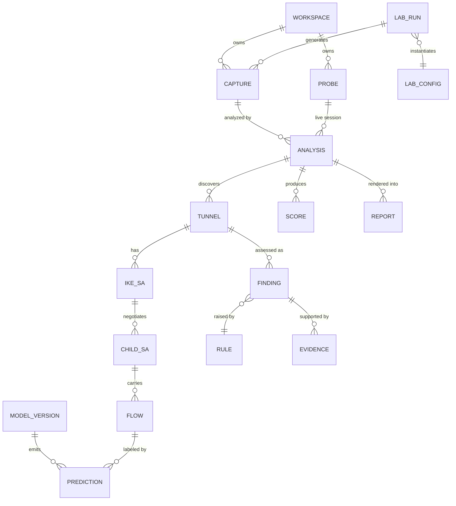
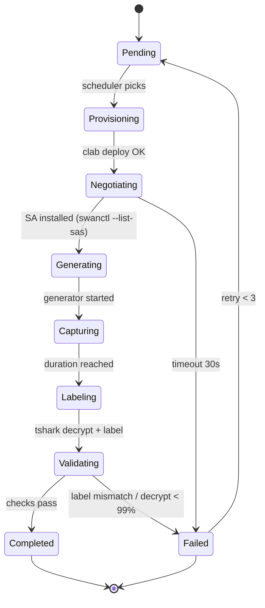
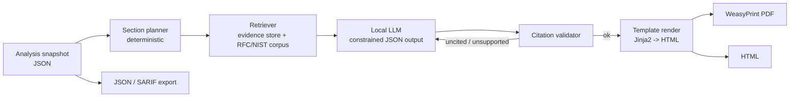

# CipherScope: Low-Level Design (LLD)

**Status:** Proposed, v1.0
**Audience:** Engineers implementing modules
**Related:** [ARCHITECTURE.md](./ARCHITECTURE.md) · [MODULES.md](./MODULES.md) · [API_REFERENCE.md](./API_REFERENCE.md)

---

## 1. Canonical data model

All components share one versioned schema family (`schemas/` in the monorepo). It is defined once in **Protobuf** for the stream and gRPC and in **Pydantic** for REST, and TypeScript types are generated for the dashboard.

### 1.1 Core entities



### 1.2 Key types (Pydantic, abridged)

```python
class Endpoint(BaseModel):
    ip: IPvAnyAddress
    port: int | None = None

class Prediction(BaseModel):
    attribute: Literal[
        "ipsec_protocol", "ike_version", "mode", "encryption_family",
        "encryption_key_bits", "integrity_alg", "dh_group", "pfs",
        "sa_lifetime_s", "replay_window", "traffic_class", "nat_t",
    ]
    value: str | int | bool | None
    source: Literal["observed", "inferred", "key_assisted", "active_probe"]
    confidence: float                    # 0..1, conformal-derived
    prediction_set: list[str]            # conformal set at alpha
    alpha: float = 0.05
    model_version: str | None = None
    explanation: list[FeatureAttribution] = []   # top-k SHAP

class Finding(BaseModel):
    id: UUID
    rule_id: str                         # e.g. "CRYPTO.WEAK_DH.MODP1024"
    dimension: Literal[
        "crypto_strength", "compliance", "sa_parameters", "key_lifetime",
        "replay_protection", "forward_secrecy", "cipher_suite", "metadata_exposure",
        "pq_readiness",
    ]
    severity: Literal["info", "low", "medium", "high", "critical"]
    likelihood: float                    # 0..1
    confidence: float                    # min(confidence of inputs)
    title: str
    description: str
    remediation: str
    standards: list[StandardRef]         # RFC/NIST/CNSA section refs
    attack_mapping: list[str]            # MITRE ATT&CK technique IDs
    evidence: list[EvidenceRef]
    tunnel_id: UUID
```

---

## 2. M1 LabForge: low-level design

### 2.1 Configuration matrix

`labforge/matrix/default.yaml`

```yaml
version: 1
axes:
  ike_version:   [ikev1, ikev2]
  mode:          [tunnel, transport]
  ip_family:     [ipv4, ipv6]
  esp_cipher:
    - { id: aes128-cbc,  integ: sha1_96 }
    - { id: aes256-cbc,  integ: sha256_128 }
    - { id: aes128gcm16, integ: null }
    - { id: aes256gcm16, integ: null }
  dh_group:      [modp1024, modp2048, ecp256, ecp384, curve25519, mlkem768_hybrid]
  pfs:           [true, false]
  traffic:       [voip, whatsapp, email, web, icmp, video, bulk]
constraints:
  - "not (ike_version == 'ikev1' and dh_group == 'mlkem768_hybrid')"   # RFC 9370 is IKEv2-only
  - "not (mode == 'transport' and topology == 'site_to_site')"
sampling:
  strategy: full            # or: pairwise | random:N
  repeats: 3                # distinct sessions per cell to support session-level splits
```

`Expander` takes the Cartesian product, applies the constraints (evaluated in a sandboxed `simpleeval`), and emits `LabConfig` rows. With the default axes the result is about 768 IPsec configurations × 7 traffic classes.

### 2.2 Topology (Containerlab)

```yaml
# labforge/topologies/site_to_site.clab.yaml
name: cs-s2s
topology:
  nodes:
    gw-a:   { kind: linux, image: cs/strongswan:6, binds: [ ./run/gw-a:/etc/swanctl ] }
    gw-b:   { kind: linux, image: cs/strongswan:6, binds: [ ./run/gw-b:/etc/swanctl ] }
    host-a: { kind: linux, image: cs/trafficgen:latest }
    host-b: { kind: linux, image: cs/trafficsink:latest }
    tap:    { kind: linux, image: cs/capture:latest }
  links:
    - endpoints: ["host-a:eth1", "gw-a:eth1"]
    - endpoints: ["gw-a:eth2",   "tap:eth1"]     # transit, captured
    - endpoints: ["tap:eth2",    "gw-b:eth2"]
    - endpoints: ["gw-b:eth1",   "host-b:eth1"]
```

`tap` bridges `eth1`↔`eth2` and runs `tcpdump -i br0 -w /cap/run.pcapng -s 0`. Transport mode uses the `host_to_host.clab.yaml` topology, where IPsec terminates on the hosts.

### 2.3 Gateway configuration template (Jinja2 → `swanctl.conf`)

```jinja
connections {
  cs {
    version = {{ 2 if cfg.ike_version == 'ikev2' else 1 }}
    local_addrs  = {{ cfg.local_ip }}
    remote_addrs = {{ cfg.remote_ip }}
    proposals = aes256-sha256-{{ cfg.ike_dh }}
    local  { auth = psk  id = gw-a }
    remote { auth = psk  id = gw-b }
    children {
      net {
        mode = {{ cfg.mode }}
        esp_proposals = {{ cfg.esp_cipher.id }}-{{ cfg.esp_cipher.integ }}-{{ cfg.esp_dh }}
        rekey_time = {{ cfg.child_rekey_s }}s
        replay_window = {{ cfg.replay_window }}
        start_action = start
      }
    }
  }
}
```

`strongswan.conf` enables `charon.plugins.save-keys { load = yes  esp = yes  ike = yes  wireshark_keys = /keys }`. This writes `esp_sa` and `ikev2_decryption_table` files that Wireshark/tshark can consume.

### 2.4 Run state machine



### 2.5 Ground-truth labeling

1. `tshark -o esp.enable_encryption_dissection:TRUE -o uat:esp_sa:...` decrypts the capture.
2. For each decrypted packet, the inner 5-tuple and application are mapped to the generator's ground-truth manifest (the generator logs its own flows with timestamps).
3. The labeler emits `labels.parquet` with columns `pkt_idx, spi, seq, label_mode, label_cipher, label_integ, label_dh, label_pfs, label_traffic, session_id, config_id`.
4. Validation requires at least 99% of ESP packets decrypted, at least one IKE_SA_INIT seen, and SPI count consistent with the expected rekeys.

---

## 3. M2 CaptureMesh: low-level design

### 3.1 eBPF/XDP filter (pseudo-C)

```c
SEC("xdp")
int cs_filter(struct xdp_md *ctx) {
    parse eth -> (vlan)* -> ipv4 | ipv6 (walk ext headers, max 6)
    if (l4_proto == IPPROTO_ESP || l4_proto == IPPROTO_AH)  goto keep;
    if (l4_proto == IPPROTO_UDP && (dport == 500 || sport == 500 ||
                                     dport == 4500 || sport == 4500)) goto keep;
    if (cfg.baseline_sample && bpf_get_prandom_u32() % cfg.baseline_1_in_n == 0) goto keep;
    return XDP_PASS;          // do not steal from the stack in mirror mode
keep:
    bpf_xdp_output / redirect into AF_XDP socket (queue-bound)
    return XDP_PASS;
}
```

### 3.2 Probe record (Protobuf)

```protobuf
message PacketRecord {
  uint64 ts_ns = 1;
  bytes  outer_src = 2;   // 4 or 16 bytes
  bytes  outer_dst = 3;
  uint32 l4_proto = 4;    // 17, 50, 51
  uint32 sport = 5;
  uint32 dport = 6;
  uint32 wire_len = 7;
  uint32 ip_ttl_hlim = 8;
  bytes  head = 9;        // first N bytes after IP header (default 256)
  uint32 direction = 10;  // 0 = A->B, 1 = B->A (canonicalised)
  uint64 flow_hash = 11;
}
```

Records are batched (≤ 512 per message or 5 ms) and published to `packets.raw.{shard}` with `shard = flow_hash % N`, so each flow stays on one consumer.

### 3.3 Ring and back-pressure policy

- Per-queue UMEM of 4096 frames × 4 KiB.
- If the Redis stream `XLEN` exceeds the high-water mark, the probe switches to **header-only mode** (head = 64 B), then **sampling mode** (1-in-N for ESP data packets only). IKE packets are **never dropped**.
- Drop counters are exported to Prometheus (`cs_probe_drops_total{reason}`).

---

## 4. Tier-1 parser (Rust crate `cs-parse`)

### 4.1 Packet classification

```text
UDP/500                 -> IKE (no marker)
UDP/4500, first 4B == 0 -> IKE over NAT-T (Non-ESP marker)
UDP/4500, first 4B != 0 -> ESP-in-UDP (RFC 3948); first 4B = SPI
UDP/4500, len == 1, 0xFF -> NAT-T keepalive
IP proto 50             -> ESP
IP proto 51             -> AH
```

### 4.2 IKE header decoding

| Offset | Size | Field | Use |
|---|---|---|---|
| 0 | 8 | Initiator SPI | IKE_SA key |
| 8 | 8 | Responder SPI | 0 in first SA_INIT request |
| 16 | 1 | Next Payload | payload chain walk |
| 17 | 1 | Version (major:4, minor:4) | **IKE version** (0x10 → v1, 0x20 → v2) |
| 18 | 1 | Exchange Type | v1: 2 = Main, 4 = Aggressive, 32 = Quick. v2: 34 = SA_INIT, 35 = AUTH, 36 = CREATE_CHILD_SA, 37 = INFORMATIONAL, 43 = IKE_INTERMEDIATE |
| 19 | 1 | Flags | Initiator/Response bits |
| 20 | 4 | Message ID | ordering, retransmits |
| 24 | 4 | Length | total message size |

In IKEv2 `IKE_SA_INIT`, the **SA, KE, Nonce, and Notify payloads are cleartext**. The parser extracts:

- **Proposals → Transforms:** ENCR (e.g. 12 = AES-CBC, 20 = AES-GCM-16), with Key Length attribute (128/256). PRF. INTEG (2 = HMAC-SHA1-96, 12 = HMAC-SHA2-256-128, 14 = HMAC-SHA2-512-256). D-H (2, 14, 15, 16, 19, 20, 21, 31, ...). ADDKE1..7 (RFC 9370).
- **KE payload:** DH Group Num + key-data length.
- **Notify:** `NAT_DETECTION_*`, `SIGNATURE_HASH_ALGORITHMS`, `IKEV2_FRAGMENTATION_SUPPORTED`, `INTERMEDIATE_EXCHANGE_SUPPORTED`, `USE_TRANSPORT_MODE` (visible only if in SA_INIT. In IKE_AUTH it is encrypted).
- **Vendor IDs:** fingerprint the implementation (strongSwan, Cisco, Fortinet, and others).

For IKEv1 Main Mode, messages 1–4 are cleartext (SA proposal + KE). Aggressive Mode additionally exposes identities, and the parser raises `IKEV1.AGGRESSIVE_MODE` as a high-severity finding.

### 4.3 KE length → DH group lookup

| Group | Name | KE data length (bytes) |
|---|---|---|
| 2 | MODP-1024 | 128 |
| 5 | MODP-1536 | 192 |
| 14 | MODP-2048 | 256 |
| 15 | MODP-3072 | 384 |
| 16 | MODP-4096 | 512 |
| 19 | ECP-256 | 64 |
| 20 | ECP-384 | 96 |
| 21 | ECP-521 | 132 |
| 31 | Curve25519 | 32 |
| 32 | Curve448 | 56 |
| ML-KEM-768 (ADDKE) | FIPS 203 | 1184 (initiator), 1088 (responder) |

This table is reused in §5.3 to infer the DH group of **encrypted** CREATE_CHILD_SA rekeys.

### 4.4 ESP header

`SPI (4) | Seq (4) | IV (var) | Ciphertext ... | Pad | PadLen (1) | NextHdr (1) | ICV (var)`

Only SPI and Seq are cleartext. The parser tracks, per SPI: `first_seen`, `last_seen`, `pkts`, `bytes`, `seq_min`, `seq_max`, `seq_regressions`, `seq_duplicates`, `seq_gaps_hist`, and length histogram.

### 4.5 Rust API surface

```rust
pub enum Parsed<'a> {
    Ike(IkeMessage<'a>),
    Esp(EspHeader),
    Ah(AhHeader),
    NatKeepalive,
    Other,
}
pub fn parse_packet(rec: &PacketRecord) -> Result<Parsed<'_>, ParseError>;

#[pyfunction] fn parse_pcap(path: &str) -> PyResult<PyArrowTable>;  // zero-copy to Polars
```

Fuzzing: `cargo fuzz` targets for `parse_ike` and `parse_esp`, run in CI nightly (≥ 1 h each).

---

## 5. Feature extraction (`cs_features`)

### 5.1 Flow and SA keys

- **Tunnel key:** unordered pair `{outer_src, outer_dst}` + `nat_t` flag.
- **IKE_SA key:** `(SPIi, SPIr)`.
- **CHILD_SA key:** `(outer_dst, SPI)`. Pairs are matched by co-occurrence timing to form bidirectional CHILD_SAs.
- **Pseudo-flow inside ESP:** since the inner 5-tuple is hidden, a flow is a **segment of one SPI stream** bounded by idle gaps > 1 s (tunable). This approximates inner sessions for the traffic classifier.

### 5.2 ESP length algebra (cipher family and integrity inference)

For an ESP packet with total ESP length `L` (from SPI to end of ICV):

$$L = 8 + IV + C + ICV$$

where `C` is ciphertext including padding, pad length, and next header.

- **AES-CBC:** `IV = 16`, `C ≡ 0 (mod 16)`. ICV ∈ {12 (SHA1-96), 16 (SHA2-256-128), 24 (SHA2-384-192), 32 (SHA2-512-256)}.
- **AES-GCM-16:** `IV = 8`, `C ≡ 0 (mod 4)`, `ICV = 16`.

For each hypothesis *h* = (IV, block, ICV), compute:

$$r_h(L) = (L - 8 - IV_h - ICV_h) \bmod block_h$$

Over many packets, the correct *h* gives `r_h = 0` for **all** packets, while wrong hypotheses show a near-uniform residue distribution. Features emitted per CHILD_SA:

| Feature | Description |
|---|---|
| `frac_zero_mod16_icv12` | share of packets with r = 0 for CBC/ICV12 |
| `frac_zero_mod16_icv16` | CBC/ICV16 |
| `frac_zero_mod16_icv32` | CBC/ICV32 |
| `frac_zero_mod4_gcm` | GCM hypothesis |
| `len_gcd` | GCD of pairwise length differences (16 → CBC-like, 4 → GCM-like) |
| `min_len`, `len_entropy` | Minimum packet size and entropy of the size distribution |

AES-128 and AES-256 **produce identical lengths**, so key size cannot be observed in ESP. `encryption_key_bits` is filled from the Tier-1 SA_INIT proposal (IKE_SA) when present. For CHILD_SA it is a **prior**: the IKE_SA proposal key size is reported with `source = inferred` and reduced confidence, and this limitation is stated in the report.

### 5.3 Encrypted rekey side-channel (PFS and DH group)

CREATE_CHILD_SA messages are encrypted, but their **length** is visible. With baseline `B`, the length of a rekey message without a KE payload (learned per IKE_SA from the first rekey or from INFORMATIONAL size + known payload overhead):

$$\Delta = L_{rekey} - B \approx KE_{len}(g) + 8$$

The engine matches Δ (after removing the encrypted payload's block padding, using the IKE_SA cipher from Tier 1) against the §4.3 table:

- Δ ≈ 0 → **PFS disabled**
- Δ ≈ 32+8 → PFS with Curve25519
- Δ ≈ 256+8 → PFS with MODP-2048, and so on.

Features: `rekey_count`, `rekey_delta_bytes[]`, `rekey_interval_s[]`, `pfs_candidate_group`, `pfs_match_error`.

### 5.4 Mode inference features (Tunnel vs Transport)

| Feature | Rationale |
|---|---|
| `outer_eq_inner_hint` | In transport mode, the outer IPs are the end hosts, which also appear in non-ESP traffic (DNS, ARP). In tunnel mode, the outer IPs are gateways |
| `min_esp_payload_len` | Tunnel mode carries an inner IP header (+20 B v4 / +40 B v6), which shifts the minimum size. An ICMP echo in transport mode is ~20 B smaller |
| `distinct_peer_ratio` | Gateways terminate many SPIs to few peers (hub-and-spoke) |
| `ttl_outer` | Gateways often reset TTL/hop limit to 64/255 |
| `ike_notify_use_transport` | Tier-1 observation, if visible |
| `spi_count_per_pair` | Tunnel mode commonly has multiple CHILD_SAs per pair (multiple subnets) |

### 5.5 Sequence features (traffic class inside ESP)

For each pseudo-flow, the first *N = 64* packets are turned into tokens:

```text
token_i = (bucket(len_i, 32 bins), dir_i ∈ {0,1}, bucket(log1p(iat_i_ms), 16 bins))
```

Aggregate statistics are also computed for the GBDT: mean/std/percentiles of size and IAT per direction, burst count and size, up/down byte ratio, packets per second, active/idle times, and FFT peak of the IAT series (VoIP shows strong 20 ms periodicity).

### 5.6 Replay and SA hygiene features

- `seq_regressions`, `seq_duplicates` per SPI (a duplicate within the replay window suggests replay or a broken anti-replay implementation).
- `esn_suspected`: sequence-number wrap without a rekey.
- `sa_lifetime_observed_s` = `last_seen − first_seen` of an SPI before its replacement.
- `bytes_per_sa` (compared against the soft/hard byte limits).

---

## 6. M4 Classifier Ensemble

### 6.1 Models

| Head | Model | Input | Output classes |
|---|---|---|---|
| `mode` | LightGBM (binary) | §5.4 features | tunnel, transport |
| `enc_family` | LightGBM (multiclass) | §5.2 features | aes-cbc, aes-gcm, other |
| `integ` | LightGBM | §5.2 features, conditional on cbc | sha1_96, sha256_128, sha384_192, sha512_256, none(aead) |
| `pfs` | LightGBM + rule | §5.3 | on, off |
| `dh_group` | Nearest-match + LightGBM | §5.3 | 2, 14, 15, 16, 19, 20, 21, 31, pq_hybrid |
| `traffic_class` | Transformer (4 layers, d = 128, 4 heads) + LightGBM on aggregates, fused by logistic stacking | §5.5 | voip, whatsapp, email, web, icmp, video, bulk |

The Transformer takes an embedding sum of the three token parts plus positional embedding, a [CLS] token, and a 2-layer MLP head, with about 0.9 M parameters. It runs on CPU in under 1 ms per flow with ONNX Runtime.

### 6.2 Training protocol

- **Splits:** grouped by `(config_id, session_id)` using `GroupKFold`. Held-out configurations are used for the generalization test (e.g. train without `ecp384`, test on it).
- **Imbalance:** class weights, plus focal loss for the Transformer.
- **Augmentation:** random packet drop (≤ 5%), IAT jitter (±10%), MTU clamp, NAT-T wrapper toggling.
- **External validation:** ISCX VPN-nonVPN 2016 and any available real-world captures (label-shift report).
- **Tracking:** every run is logged to MLflow with dataset hash, git SHA, metrics, and confusion matrices.

### 6.3 Calibration (conformal)

Split conformal via MAPIE uses a held-out calibration set (20% of training groups). For each head:

$$\hat{C}(x) = \{\, y : s(x, y) \le \hat{q}_{1-\alpha} \,\}$$

where `s` is the nonconformity score (1 − p̂ for LAC, or APS for multi-class).

**AI Confidence Score** per prediction:

```text
confidence = p̂(top) if |Ĉ| == 1 else p̂(top) * (1 / |Ĉ|)
```

This is reported alongside the set itself. The finding-level confidence is the **minimum** confidence of the predictions it depends on.

### 6.4 Explainability

TreeSHAP is used for GBDT heads and Integrated Gradients for the Transformer (top-10 token positions). The top-k attributions are stored in `Prediction.explanation` and rendered as a waterfall in the Tunnel Inspector.

### 6.5 Serving contract

```python
class InferenceRequest(BaseModel):
    tunnel_id: UUID
    child_sa_id: UUID | None
    features: dict[str, float]          # tabular
    tokens: list[tuple[int, int, int]] | None  # sequence
    heads: list[str]                    # which heads to run

class InferenceResponse(BaseModel):
    predictions: list[Prediction]
    latency_ms: float
    model_versions: dict[str, str]
```

---

## 7. M5 Posture Engine

### 7.1 Rule format (rules-as-data)

```yaml
# posture/rules/crypto/weak_dh.yaml
id: CRYPTO.WEAK_DH.MODP1024
dimension: crypto_strength
severity: high
likelihood: 0.6
when:
  any:
    - attr: dh_group
      op: in
      value: [1, 2, 5, 22, 23, 24]
title: "Weak Diffie-Hellman group negotiated"
description: >
  The tunnel uses DH group {{ dh_group }} ({{ dh_bits }} bits), which is below the
  2048-bit MODP / 256-bit ECP minimum.
remediation: "Configure DH group 19, 20, or 31, and add ML-KEM-768 via RFC 9370 for PQ resistance."
standards:
  - { doc: "RFC 8247", section: "2.4" }
  - { doc: "NIST SP 800-77r1", section: "4.x" }
attack: ["T1557", "T1040"]
```

The rule evaluator is a small, deterministic, sandboxed interpreter (no `eval`). Predicates: `eq, ne, in, not_in, lt, lte, gt, gte, exists, missing, and, any, not`. Each predicate can require `min_confidence` (default 0.7). If the input confidence is lower, the finding is emitted as `status = "suspected"`.

### 7.2 Assessment dimensions and example rules

| Dimension | Example rule IDs |
|---|---|
| crypto_strength | `CRYPTO.WEAK_DH.*`, `CRYPTO.3DES`, `CRYPTO.AES128_ONLY_CNSA`, `CRYPTO.SHA1_PRF` |
| compliance | `COMP.NIST80077.*`, `COMP.RFC8221.MUST_NOT.*`, `COMP.CNSA2.*`, `COMP.CERTIN.*` |
| sa_parameters | `SA.NO_ESN_HIGH_RATE`, `SA.MULTIPLE_WEAK_PROPOSALS_ACCEPTED` |
| key_lifetime | `LIFE.CHILD_GT_8H`, `LIFE.IKE_GT_24H`, `LIFE.BYTES_LIMIT_ABSENT` |
| replay_protection | `REPLAY.SEQ_DUPLICATE`, `REPLAY.SEQ_REGRESSION`, `REPLAY.WINDOW_DISABLED_SUSPECTED` |
| forward_secrecy | `PFS.DISABLED`, `PFS.WEAK_GROUP` |
| cipher_suite | `SUITE.CBC_WITHOUT_ETM_EQUIV`, `SUITE.NULL_ENCRYPTION`, `SUITE.AH_ONLY` |
| metadata_exposure | `META.TRAFFIC_CLASS_LEAK`, `META.NO_TFC_PADDING`, `META.VENDOR_ID_DISCLOSED`, `META.IKEV1_AGGRESSIVE_ID` |
| pq_readiness | `PQ.NO_HYBRID_KE`, `PQ.NO_INTERMEDIATE`, `PQ.LONG_LIVED_SECRETS` |

### 7.3 Scoring

Per finding *f*:

$$risk_f = w_{sev}(f) \times likelihood_f \times confidence_f$$

with `w_sev = {info: 0, low: 1, medium: 3, high: 6, critical: 10}`.

Per dimension *d*, with saturation to prevent one noisy dimension dominating:

$$R_d = 1 - \prod_{f \in d} \left(1 - \frac{risk_f}{10}\right)$$

**Security Score (0–100):**

$$S = 100 \times \left(1 - \sum_d W_d \cdot R_d\right), \quad \sum_d W_d = 1$$

Default dimension weights (published and overridable per workspace): crypto 0.20, forward_secrecy 0.15, cipher_suite 0.15, compliance 0.10, key_lifetime 0.10, replay 0.10, metadata 0.10, sa_params 0.05, pq 0.05.

**Metadata leakage score:**

$$Leak = \max(0, \frac{F1_{macro}^{traffic} - 1/K}{1 - 1/K})$$

This measures how far CipherScope's own traffic classifier beats chance (*K* classes) on the tunnel. Higher means more leakage.

**Grade bands:** A ≥ 90, B ≥ 75, C ≥ 60, D ≥ 40, F < 40.

### 7.4 Threat matrix

Each finding is placed in a 5×5 grid, with likelihood bucket (x) and impact = severity (y). Cells aggregate the finding count and max risk. Each cell also lists the mapped ATT&CK techniques (for example T1040 Network Sniffing, T1557 Adversary-in-the-Middle, T1600 Weaken Encryption, T1573 Encrypted Channel).

---

## 8. M6 Report Studio

### 8.1 Pipeline



### 8.2 Grounding contract

The LLM must return:

```json
{
  "section": "forward_secrecy",
  "paragraphs": [
    { "text": "Perfect Forward Secrecy is disabled on 3 of 5 tunnels.",
      "citations": ["finding:6f1c...", "std:RFC7296#1.3.2"] }
  ]
}
```

The validator checks that every paragraph has at least one citation, that every cited ID exists in the retrieval set, and that numbers in the text match the analysis snapshot (regex extraction and comparison). If validation fails after two retries, the section falls back to a deterministic template.

### 8.3 Report types

| Report | Sections |
|---|---|
| **Executive** | Score and grade, trend, top 5 risks in plain language, business impact, 30/60/90-day remediation plan, PQ readiness |
| **Technical** | Scope and method, tunnel inventory, per-tunnel SA timeline, full findings with evidence and SHAP, compliance matrix, threat matrix, AI confidence table, metadata-leakage analysis, appendix (rule catalog and model card) |
| **Compliance** | Control-by-control pass/fail/suspected for the selected pack |
| **Machine** | JSON (schema `cs.report.v1`), SARIF 2.1, CEF events |

---

## 9. Database schema (PostgreSQL, abridged DDL)

```sql
CREATE TABLE workspace (id uuid PRIMARY KEY, name text NOT NULL, created_at timestamptz DEFAULT now());

CREATE TABLE capture (
  id uuid PRIMARY KEY, workspace_id uuid REFERENCES workspace(id),
  object_key text NOT NULL, sha256 bytea NOT NULL, size_bytes bigint,
  source text CHECK (source IN ('upload','probe','labforge')),
  lab_run_id uuid NULL, created_at timestamptz DEFAULT now(),
  UNIQUE (workspace_id, sha256)
);

CREATE TABLE analysis (
  id uuid PRIMARY KEY, workspace_id uuid, capture_id uuid NULL, probe_id uuid NULL,
  profile text NOT NULL,                 -- passive | key_assisted | active
  status text NOT NULL,                  -- queued|running|completed|failed|cancelled
  progress real DEFAULT 0, model_bundle text, rule_pack text,
  started_at timestamptz, finished_at timestamptz
);

CREATE TABLE tunnel (
  id uuid PRIMARY KEY, analysis_id uuid REFERENCES analysis(id) ON DELETE CASCADE,
  peer_a inet, peer_b inet, nat_t boolean, ip_family smallint,
  implementation_hint text, first_seen timestamptz, last_seen timestamptz
);

CREATE TABLE ike_sa (
  id uuid PRIMARY KEY, tunnel_id uuid REFERENCES tunnel(id) ON DELETE CASCADE,
  spi_i bytea, spi_r bytea, ike_version smallint, proposals jsonb,
  selected jsonb, vendor_ids text[], established_at timestamptz
);

CREATE TABLE child_sa (
  id uuid PRIMARY KEY, ike_sa_id uuid REFERENCES ike_sa(id) ON DELETE CASCADE,
  spi_out bytea, spi_in bytea, first_seen timestamptz, last_seen timestamptz,
  pkts bigint, bytes bigint, seq_max bigint, seq_regressions int, seq_duplicates int,
  rekey_of uuid NULL
);

CREATE TABLE prediction (
  id bigserial PRIMARY KEY, subject_type text, subject_id uuid,
  attribute text, value text, source text, confidence real,
  prediction_set text[], alpha real, model_version text, explanation jsonb
);
CREATE INDEX ON prediction (subject_id, attribute);

CREATE TABLE finding (
  id uuid PRIMARY KEY, analysis_id uuid, tunnel_id uuid, rule_id text,
  dimension text, severity text, likelihood real, confidence real, risk real,
  status text DEFAULT 'open',            -- open|suspected|accepted|resolved|false_positive
  title text, description text, remediation text,
  standards jsonb, attack text[], evidence jsonb, created_at timestamptz DEFAULT now()
);
CREATE INDEX ON finding (analysis_id, severity);

CREATE TABLE score (
  analysis_id uuid, tunnel_id uuid NULL, dimension text, value real, grade char(1),
  computed_at timestamptz DEFAULT now()
);

-- Timescale hypertable for live metrics
CREATE TABLE tunnel_metric (
  ts timestamptz NOT NULL, tunnel_id uuid, pps real, bps real,
  active_child_sas int, security_score real, leak_score real
);
SELECT create_hypertable('tunnel_metric', 'ts');

CREATE TABLE report (
  id uuid PRIMARY KEY, analysis_id uuid, kind text, format text,
  object_key text, status text, created_by uuid, created_at timestamptz DEFAULT now()
);

CREATE TABLE audit_log (
  id bigserial PRIMARY KEY, ts timestamptz DEFAULT now(), actor uuid, action text,
  target text, details jsonb, prev_hash bytea, hash bytea
);
```

---

## 10. Streaming contracts (Redis Streams)

| Stream | Producer | Consumer group | Payload | Retention |
|---|---|---|---|---|
| `packets.raw.{shard}` | Probe | `analyzer` | `PacketBatch` (protobuf) | MAXLEN ~ 2M |
| `flows.ready` | Analyzer | `classifier` | `FlowFeatures` | MAXLEN ~ 500k |
| `flows.classified` | Classifier | `posture` | `ClassifiedFlow` | MAXLEN ~ 500k |
| `findings.new` | Posture | `api-fanout`, `siem-export` | `Finding` (JSON) | 7 days |
| `jobs.events` | Workers | `api-fanout` | progress events | 1 day |

Message headers: `schema`, `schema_version`, `trace_id`, `workspace_id`, `produced_at`.
Delivery: at-least-once. Consumers are idempotent (upsert by natural keys), and the pending-entries list is reclaimed with `XAUTOCLAIM` after 60 s.

---

## 11. Error handling and edge cases

| Case | Behavior |
|---|---|
| Truncated / malformed IKE | `ParseError` recorded as evidence. Packet counted in `cs_parse_errors_total`. Pipeline continues |
| IKE fragmentation (RFC 7383) | Reassembled by Message ID + fragment number before payload parsing |
| Mid-session capture (no SA_INIT) | Tier-1 attributes marked `missing`. Tier-2/3 inference only. Confidence capped at 0.8 for crypto attributes |
| Asymmetric capture (one direction) | CHILD_SA pairing skipped. `pfs` inference disabled unless both rekey directions are visible |
| NAT-T with keepalives | Keepalives excluded from length algebra |
| Multiple tunnels same peers | Separated by IKE_SA SPIs. ESP SPIs mapped by rekey timing |
| Jumbo / fragmented outer IP | Outer IP reassembly (bounded buffer, 30 s timeout) before ESP length computation |
| Model unavailable | Tier-1 results and rules still run. Findings requiring ML are skipped with an `INFO` note |
