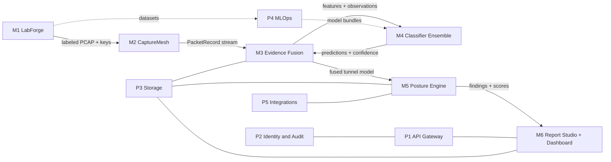

# CipherScope: Module Specifications

**Status:** Proposed, v1.0
**Related:** [ARCHITECTURE.md](./ARCHITECTURE.md) · [LOW_LEVEL_DESIGN.md](./LOW_LEVEL_DESIGN.md) · [REPO_STRUCTURE.md](./REPO_STRUCTURE.md)

CipherScope has **six functional modules (M1–M6)** and **five platform services (P1–P5)**. Each module has a single owner, a published interface, and a folder in the monorepo.

---

## M1: LabForge (VPN Testbed Generation)

**Purpose:** Reproducibly build IPsec deployments across the full configuration space and produce perfectly labeled captures.

| Item | Detail |
|---|---|
| Owner | Lab / Data team |
| Path | `labforge/` |
| Language | Python 3.12 (orchestrator), Jinja2, YAML, Bash |
| Runtime | Docker, Containerlab, Linux XFRM, strongSwan 6.x, Libreswan 5.x, optional VyOS |
| Inputs | `matrix/*.yaml`, `topologies/*.clab.yaml`, `generators/*` |
| Outputs | `capture.pcapng`, `keys/esp_sa`, `keys/ikev2_decryption_table`, `labels.parquet`, `manifest.json` |
| Interfaces | CLI `labforge run --matrix default --parallel 8`. REST via P1 (`/lab/*`). Emits `lab.events` |

### Submodules

| Submodule | Responsibility |
|---|---|
| `labforge.matrix` | Parse and expand the configuration matrix, apply constraints, support sampling (full / pairwise / random) |
| `labforge.render` | Render `swanctl.conf`, `strongswan.conf`, `ipsec.conf` (Libreswan), and VyOS config from templates |
| `labforge.topology` | Wrap Containerlab deploy/destroy, IPv4/IPv6 addressing plan, and the link-capture bridge |
| `labforge.generators` | Traffic drivers: **VoIP** (SIPp + RTP G.711/Opus), **WhatsApp** (Android emulator + ADB scripted calls/messages, or replayed traces), **E-mail** (Postfix/Dovecot, SMTP/IMAP scripted sends), **Web** (Playwright headless Chromium over a site list), **ICMP** (ping/ping6 with size sweeps), **Video** (FFmpeg HLS/DASH server + client), **Bulk** (iperf3, scp) |
| `labforge.capture` | tcpdump orchestration, ring files, clock sync (chrony) |
| `labforge.label` | tshark decryption with exported keys, alignment with the generator manifest, `labels.parquet` |
| `labforge.validate` | Decryption ratio, SA count, rekey count, and label-coverage checks |
| `labforge.dataset` | Package runs into a versioned dataset (`dataset_vN`), with dataset card, hash, and splits file |

### Supported configuration axes (maps to requirement a)

Tunnel / Transport · AES-128 / AES-256 · AES-GCM-16 · AES-CBC + HMAC-SHA1-96 / SHA2-256-128 / SHA2-512-256 · DH 2, 14, 15, 16, 19, 20, 21, 31 + ML-KEM-768 hybrid · PFS on/off · IPv4 / IPv6 · IKEv1 / IKEv2 · NAT-T on/off · lifetimes · replay window · traffic: VoIP, WhatsApp, E-mail, Web, ICMP, Video, Bulk.

---

## M2: CaptureMesh (Traffic Acquisition)

**Purpose:** Acquire IPsec-relevant traffic from files, tools, or live interfaces, and normalize it into `PacketRecord`s.

| Item | Detail |
|---|---|
| Owner | Sensor team |
| Path | `capturemesh/` |
| Language | Rust (probe), C (eBPF), Python (import adapters) |
| Inputs | NIC (SPAN/TAP), PCAP/PCAPNG, tcpdump/tshark rings, Zeek logs (optional enrichment) |
| Outputs | `packets.raw.{shard}` Redis stream. Rotated PCAP segments in the object store |
| Interfaces | `cs-probe --iface eth1 --mode xdp --shards 8`. gRPC `ProbeControl` (start/stop/filter). P1 `/probes/*` |

### Submodules

| Submodule | Responsibility |
|---|---|
| `probe-xdp` | eBPF/XDP filter + AF_XDP zero-copy receive. Fallback to `AF_PACKET` TPACKET_V3 |
| `probe-core` | Flow hashing, direction canonicalization, batching, back-pressure modes |
| `probe-edge` | ARM64 build for Raspberry Pi 5. Store-and-forward. Compact flow-record mode |
| `importers` | PCAP/PCAPNG reader (Rust `pcap-parser`), tshark JSON adapter, remote tcpdump over SSH |
| `rotator` | PCAP segment rotation and upload for evidence retention |

Captured classes (maps to requirement b): IKE negotiation (UDP 500/4500), ESP (50), ESP-in-UDP, AH (51), NAT-T keepalives, and sampled normal traffic as a baseline.

---

## M3: Evidence Fusion Engine (Tri-Mode Analysis)

**Purpose:** Turn packets into a coherent **tunnel model** by fusing deterministic observations, ML inferences, optional active-probe results, and optional key-assisted decryption.

| Item | Detail |
|---|---|
| Owner | Core analysis team |
| Path | `engine/` (`parser-rs`, `cs_features`, `cs_fusion`) |
| Language | Rust (parser), Python (features, fusion) |
| Inputs | `PacketRecord`s, analyst keys (optional), active-probe results (optional) |
| Outputs | `Tunnel`, `IkeSa`, `ChildSa`, `Flow`, `Observation`, `Prediction` records, plus `flows.ready` stream |

### Analysis modes

| Mode | What it adds | Authorization |
|---|---|---|
| **Passive** (default) | Tier-1 parsing + side-channel features + ML | None beyond capture rights |
| **Key-assisted** | Decrypts ESP/IKE with supplied keys, giving exact ground truth for mode, integrity, inner protocols, and IKE_AUTH content (IDs, auth method, certificates) | Analyst uploads keys. Encrypted and short-lived |
| **Active probe** | Sends crafted IKE_SA_INIT proposals to a gateway to enumerate **accepted** weak suites (e.g. does it still accept MODP-1024 or 3DES?) | Signed authorization + allowlist + rate limit |

### Fusion rules

1. `key_assisted` > `observed` > `active_probe` (for accepted-but-not-negotiated) > `inferred`.
2. Conflicts between sources create a `FUSION.CONFLICT.<attr>` informational finding with both values.
3. Each attribute has a **provenance chain** (source, packets, features, model version).

### Submodules

| Submodule | Responsibility |
|---|---|
| `parser-rs` | IKEv1/v2, ESP, AH, NAT-T parsing. Fragment reassembly. PyO3 bindings |
| `cs_features.flow` | Tunnel/IKE_SA/CHILD_SA/pseudo-flow tables |
| `cs_features.esp_algebra` | Length-residue features (LLD §5.2) |
| `cs_features.rekey` | Encrypted rekey side-channel features (LLD §5.3) |
| `cs_features.mode` | Tunnel vs transport features (LLD §5.4) |
| `cs_features.sequence` | Tokenization for the Transformer (LLD §5.5) |
| `cs_features.replay` | Sequence-number hygiene (LLD §5.6) |
| `cs_fusion` | Precedence, conflict detection, provenance |
| `cs_active` | Active prober (IKE_SA_INIT crafting with Scapy/`ike-scan`-style logic), guarded |
| `cs_decrypt` | Key-assisted decryption via tshark or native AES-GCM/CBC implementation |

---

## M4: AI Classifier Ensemble

**Purpose:** Infer the protocol attributes and traffic class that cannot be read directly, with calibrated confidence and explanations.

| Item | Detail |
|---|---|
| Owner | ML team |
| Path | `ml/` (training), `engine/cs_infer/` (serving) |
| Language | Python (PyTorch, LightGBM, MAPIE, SHAP), ONNX |
| Inputs | Feature vectors and token sequences from M3 |
| Outputs | `Prediction` objects (value, set, confidence, SHAP) |
| Interfaces | In-process Python API `Ensemble.predict(req)`. Optional gRPC `InferenceService` for GPU offload |

### Heads (maps to requirement c)

| Requirement | Head | Primary source |
|---|---|---|
| IPsec protocol (ESP / AH / ESP-in-UDP) | `ipsec_protocol` | Tier 1 |
| IKE version | `ike_version` | Tier 1 |
| Tunnel / Transport mode | `mode` | Tier 2 |
| Encryption algorithm | `enc_family` + `encryption_key_bits` | Tier 2 + Tier 1 prior |
| Authentication algorithm | `integ` | Tier 2 (+ Tier 1 IKE proposal) |
| Key exchange method | `dh_group`, `pfs` | Tier 1 (IKE_SA) + Tier 2 (rekeys) |
| SA characteristics | lifetime, rekey interval, ESN, replay | Tier 1 + features |
| Traffic type inside ESP | `traffic_class` | Tier 3 + stacking |

### Artifacts

A `model_bundle_vX.Y.Z.tar` contains `*.onnx`, `calibrators.pkl` (MAPIE, loaded via safe allowlist), `feature_schema.json`, `model_card.md`, `metrics.json`, and a signature (`cosign`).

---

## M5: Posture Engine (Security Assessment)

**Purpose:** Evaluate the fused tunnel model against rules and compliance packs, then compute risk, scores, grades, leakage, PQ readiness, and the threat matrix.

| Item | Detail |
|---|---|
| Owner | Security research team |
| Path | `posture/` |
| Language | Python + YAML rules |
| Inputs | Fused tunnel model + predictions |
| Outputs | `Finding`s, `Score`s, `ThreatMatrix`, `findings.new` stream |
| Interfaces | `PostureEngine.assess(tunnel_model, pack="nist-800-77r1")`. P1 `/findings`, `/scores`, `/threat-matrix` |

### Compliance packs

| Pack ID | Source |
|---|---|
| `nist-800-77r1` | NIST SP 800-77 Rev. 1, Guide to IPsec VPNs |
| `rfc8221-8247` | RFC 8221 (ESP/AH algorithm requirements), RFC 8247 (IKEv2 algorithm requirements) |
| `cnsa-2.0` | NSA CNSA 2.0 (AES-256, SHA-384, ECDH P-384 → ML-KEM-1024 transition) |
| `certin-baseline` | Indian CERT-In / NCIIPC-aligned crypto baseline (configurable) |
| `custom` | Workspace-defined YAML overlay |

### Assessment dimensions (maps to requirement d)

Cryptographic strength · Configuration compliance · SA parameters · Key lifetime · Replay protection · Forward secrecy · Cipher suite strength · Metadata exposure · **PQ readiness** (extra).

---

## M6: Report Studio and Dashboard

**Purpose:** Present results interactively and generate grounded reports.

| Item | Detail |
|---|---|
| Owner | Product / frontend team + ML team (LLM) |
| Paths | `apps/dashboard/` (Next.js), `services/report/` (Python) |
| Language | TypeScript, Python |
| Inputs | Analysis snapshot via P1 |
| Outputs | Dashboard views. Executive / Technical / Compliance reports (PDF, HTML, JSON, SARIF) |

### Dashboard views

| View | Content |
|---|---|
| **Overview** | Security score gauge, grade, 30-day trend, active tunnels, top findings, leakage and PQ badges |
| **Captures and Analyses** | Upload, job progress (WebSocket), history, re-run with new model or rule pack |
| **Tunnel Inspector** | Peer pair, IKE_SA/CHILD_SA timeline (rekeys, SPI lifecycles), proposals table, per-attribute prediction with confidence bars and SHAP waterfall, evidence packet list |
| **Findings** | Filter by severity/dimension/status. Bulk accept/false-positive. Remediation text |
| **Threat Matrix** | 5×5 likelihood × impact heat map (D3), ATT&CK drill-down |
| **Compliance** | Pack selector, control pass/fail/suspected table |
| **Reports** | Generate / download Executive, Technical, Compliance. Report history |
| **LabForge Console** | Matrix editor, run queue, dataset browser |
| **Models** | Active bundle, metrics, calibration plots, drift (PSI) |
| **Settings** | Workspace, users/roles, API keys, integrations, scoring weights |

### Report Studio submodules

`planner` (deterministic section plan) · `retriever` (pgvector over evidence + corpus) · `llm` (Ollama client, JSON schema-constrained decoding) · `validator` (citations + numeric consistency) · `render` (Jinja2 → HTML → WeasyPrint PDF) · `exporters` (JSON, SARIF, CEF).

---

## Platform services

| ID | Service | Responsibility | Path |
|---|---|---|---|
| **P1** | API Gateway | FastAPI REST + WebSocket, OpenAPI, request validation, pagination, rate limiting | `services/api/` |
| **P2** | Identity and Audit | OIDC, RBAC, API keys, workspace isolation, hash-chained audit log | `services/api/auth/`, `services/audit/` |
| **P3** | Storage | PostgreSQL/Timescale migrations (Alembic), MinIO buckets, key vault wrapper | `services/storage/`, `deploy/` |
| **P4** | MLOps | Dataset registry, training pipelines, MLflow, bundle signing, drift monitoring, shadow deployment | `ml/pipelines/` |
| **P5** | Integrations | SIEM export (Splunk HEC, Elastic, Wazuh), Zeek/Suricata enrichment scripts, webhooks, ticketing (Jira) | `services/integrations/` |

---

## Module dependency matrix

| ↓ depends on → | M1 | M2 | M3 | M4 | M5 | M6 | P1 | P2 | P3 | P4 | P5 |
|---|---|---|---|---|---|---|---|---|---|---|---|
| **M1 LabForge** | – | ✓ (capture lib) | | | | | ✓ | ✓ | ✓ | | |
| **M2 CaptureMesh** | | – | | | | | ✓ (control) | ✓ | ✓ | | |
| **M3 Evidence Fusion** | | ✓ | – | ✓ | | | | | ✓ | | |
| **M4 Classifier** | | | ✓ (schema) | – | | | | | | ✓ | |
| **M5 Posture** | | | ✓ | ✓ | – | | | | ✓ | | ✓ |
| **M6 Report/UI** | | | | | ✓ | – | ✓ | ✓ | ✓ | | |
| **P4 MLOps** | ✓ | | ✓ | ✓ | | | | | ✓ | – | |

Shared contract package: `schemas/` (Protobuf + JSON Schema) is a dependency of every module.
