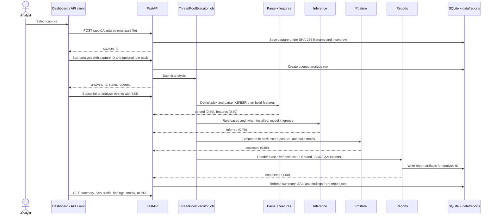

# CipherScope run sequence

This document records the sequence implemented in the repository as inspected
on 2026-09-29. It separates the normal capture-analysis workflow from the
optional lab and model-training workflows, and calls out startup paths that are
not currently runnable.

`docs/mvp.md` and `docs/repo.md` remain the MVP specification. This is a
code-verified operational companion, not a replacement for either document.

## 1. Choose the workflow

| Goal | Required sequence | Optional work |
|---|---|---|
| Analyze an existing PCAP | Start the API and dashboard, then upload/analyze the PCAP. | Train models for ML predictions. Without them, rules-based inference still runs. |
| Generate a lab capture | Start the strongSwan lab and capture sidecar, then run selected profiles and traffic. | Build a dataset and train models from the resulting sessions. |
| Train/evaluate models | Generate labeled lab sessions, build the dataset, then train and evaluate. | Start the API/dashboard only when you want to inspect analyses. |

For a first run, use an existing PCAP (or a fixture under
`tests/fixtures/pcaps/`). The lab is not required for upload-based analysis.

## 2. Start the locally runnable application

Prerequisites: Python 3.11+, Node.js, and `pnpm`. `uv` is the recommended
Python environment manager but is not supplied by this repository.

First enter the repository root. Do not run the remaining commands from your
home directory or another project:

```bash
cd CipherScore
test -f pyproject.toml && test -d web && echo "CipherScope repository found"
```

If `uv --version` reports `command not found`, install it using the official
installer, then open a new terminal (or reload your shell) before continuing:

```bash
curl -LsSf https://astral.sh/uv/install.sh | sh
```

Install dependencies from the repository root:

```bash
uv sync
(cd web && pnpm install)
```

If installing `uv` is not an option, create a standard virtual environment
instead. Run this from the repository root, then use `python` in place of
`uv run python` in the commands below:

```bash
python3 -m venv .venv
source .venv/bin/activate
python -m pip install --upgrade pip
python -m pip install -e '.[dev]'
(cd web && pnpm install)
```

Start the API in **terminal 1**. It must be launched from the repository root,
not from `web/`:

```bash
cd CipherScore
unset VIRTUAL_ENV  # only needed if uv reports a VIRTUAL_ENV mismatch
uv run uvicorn api.main:app --reload --port 8000
```

In **terminal 2**, start the dashboard:

```bash
cd CipherScore/web
pnpm dev
```

The dashboard is served at <http://localhost:3000>; the API and interactive
API documentation are at <http://localhost:8000/api/v1/healthz> and
<http://localhost:8000/docs> respectively. API startup creates the SQLite
database under `data/` and attempts to load each registered model.

If you choose a different API port, such as `8008`, the dashboard must be
started with the matching API base URL:

```bash
cd CipherScore/web
NEXT_PUBLIC_API_URL=http://localhost:8008/api/v1 pnpm dev
```

## 3. Capture-to-report sequence

This is the actual API/pipeline sequence for an uploaded `.pcap` or
`.pcapng` file:



The pipeline stages are implemented in `analyzer/pipeline.py` in this order:

1. **Parse (30%)** — stream packets; classify IKE, ESP, and NAT-T ESP; parse
   IKE; construct Security Association (SA) tracks.
2. **Features (50%)** — derive five-second flow windows, ESP structure, and
   size offsets for each SA.
3. **Inference (70%)** — read visible IKE information and run the classifier
   ensemble where model artifacts are available.
4. **Assessment (85%)** — apply the selected rule pack, calculate posture,
   threat matrix, compliance, and metadata exposure.
5. **Reports (100%)** — create `executive.pdf`, `technical.pdf`,
   `report.json`, and `findings.csv` in `data/reports/<analysis_id>/`.

The supported API order is therefore:

```text
POST /captures  -> capture_id
POST /analyses  -> analysis_id
GET  /analyses/{analysis_id}/events       (optional SSE progress)
GET  /analyses/{analysis_id}              (summary/status)
GET  /analyses/{analysis_id}/sas|traffic|findings|threat-matrix
GET  /analyses/{analysis_id}/reports/{executive|technical}.pdf
```

`rule_pack` is optional on `POST /analyses`; it defaults to
`ipsec-baseline`. Uploads are limited to 500 MB by default.

## 4. Optional lab, data, and model sequence

The intended offline preparation order is:

```text
lab profiles + traffic
    -> labeled PCAP sessions in data/sessions/
    -> dataset features, labels, and splits
    -> trained/calibrated artifacts in models/
    -> API inference uses those artifacts on later analyses
```

The corresponding Make targets are:

```bash
make lab-up
make lab-run PROFILES=p01,p07 TRAFFIC=icmp,web
make dataset
make train
make eval
```

Each lab session is intended to bring up the SA, start `tcpdump`, generate
traffic, stop and flush the capture, then tear down the SA. A session may then
be analyzed through `POST /analyses` with `lab_session_id` instead of
`capture_id`.

No trained model is currently registered: every value in `models/registry.json`
is `null`. This does not prevent analysis; the loader deliberately falls back
to rules-based results and marks unavailable ML-derived values as unknown.

## 5. Current implementation gaps

The following differences matter when following the sequence above:

- `make up` / `docker compose up` is **not runnable as checked**: the `web`
  service builds `./web`, but `web/Dockerfile` does not exist. The build stops
  with `failed to read dockerfile: open Dockerfile: no such file or directory`.
  Use the local API/dashboard commands in section 2 until that Dockerfile is
  added.
- The lab runner invokes `docker exec capture ...`, while Compose normally
  creates a project-prefixed capture-container name. It also requires the
  capture sidecar to be running alongside the lab. Treat the lab sequence as
  an implementation target that needs this container-name/wiring check before
  relying on it end to end.
- Local live mode writes its rolling files to
  `CS_DATA_DIR/sessions/_live` (default: `data/sessions/_live`). It still
  requires a packet-capture tool plus network-capture privileges
  (`NET_RAW`/`NET_ADMIN`). The implementation prefers `dumpcap` (which Linux
  distributions can grant narrowly to members of the `wireshark` group) and
  falls back to `tcpdump`. Startup failures return a clear `503` response.
- The New Analysis page uploads a capture and starts a job, but it currently
  only displays the `analysis_id`; it does not navigate to the analysis page.
  The reusable SSE progress component exists, but the visible analysis pages
  do not currently mount it. The API SSE endpoint itself publishes the five
  stages listed above.
- If an analysis job raises an exception, the job runner emits an SSE `failed`
  event. It does not currently change the SQLite analysis row from `queued` to
  `failed`; check the stream when diagnosing a failed run.

## 6. Direct CLI path

To bypass the API and dashboard, run the same analyzer pipeline directly:

```bash
uv run python -m analyzer.cli analyze tests/fixtures/pcaps/ikev2_sa_init_aes256gcm_ecp384.pcapng --out data/reports/manual
```

This is the shortest way to confirm parsing, assessment, and report rendering
for a local fixture.
