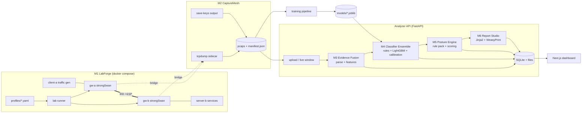
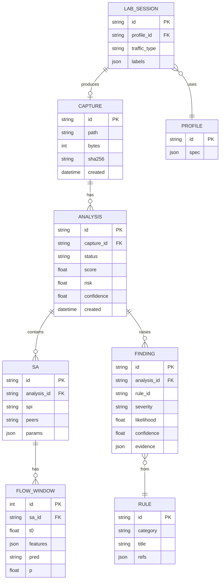
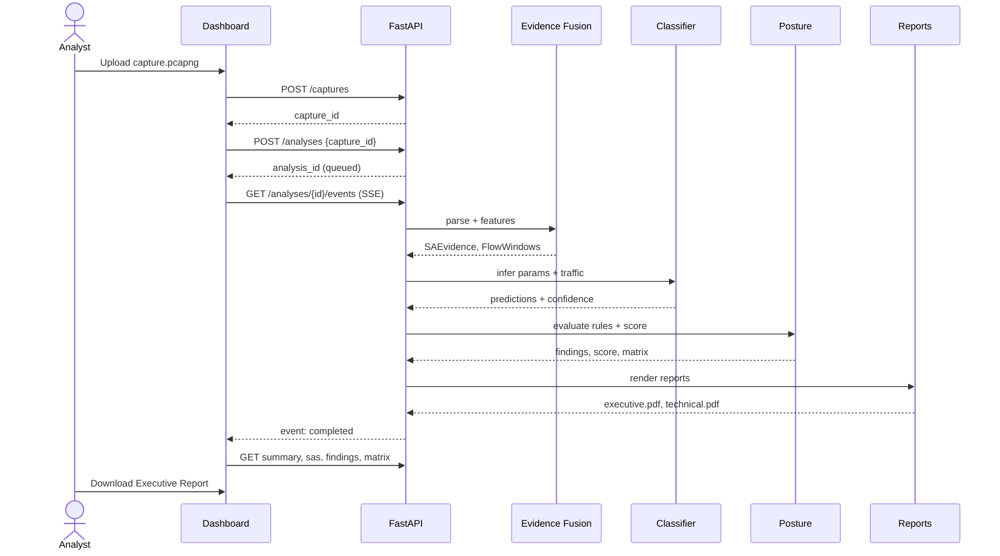

# CipherScope MVP: Prototype Specification

> **Goal of the MVP:** a working end-to-end prototype of the problem statement. It builds IPsec VPNs in a lab, captures their traffic, identifies the protocol and crypto parameters **from the captures alone**, assesses the security posture, and produces an Executive and Technical report on an interactive dashboard. The full platform in [ARCHITECTURE.md](./ARCHITECTURE.md) is the destination. This document covers the smallest version that meets **every mandatory point** of the problem statement and can be demonstrated live.

Companion document: [repo.md](./repo.md) gives the exact repository layout for this MVP.

---

## 0. MVP at a glance

| Item | MVP decision |
|---|---|
| Form factor | One `docker compose up` stack on one Linux host (laptop or VM, 8 GB RAM) |
| Testbed | strongSwan 5.9+ containers driven by a YAML **profile matrix** (16 base profiles, expandable) |
| Capture | `tcpdump` sidecar on the lab bridge; ground-truth labels from strongSwan `save-keys` plus the profile manifest |
| Analysis input | Offline `.pcap/.pcapng` upload **and** a limited live mode (10 s rolling windows on one interface) |
| AI engine | Deterministic IKE parser + ESP structural inference + LightGBM classifiers + calibrated confidence |
| Assessment | YAML rule pack mapped to RFC 8221, RFC 8247, NIST SP 800-77r1, and CNSA 2.0 |
| Output | Security Score, Risk Score, Threat Matrix, AI Confidence, metadata inference, Executive and Technical PDF |
| Backend | Python 3.11, FastAPI, SQLite, local file storage, in-process job queue |
| Frontend | Next.js 16 + shadcn/ui + Recharts dashboard |
| Dataset | Labeled PCAP set + extracted feature Parquet + `labels.csv`, published with the repo |

### What "viable" means here

1. **Every** required item in parts (a)–(e) of the problem statement has a working code path (see the traceability matrix in §11).
2. The demo runs offline with no cloud services.
3. Results for a known lab capture can be checked against the profile that produced it. **Ground truth is always available**, so accuracy is measured, not claimed.

---

## 1. MVP scope

### 1.1 In scope (must ship)

| Area | Included in the MVP |
|---|---|
| **(a) Testbed** | Tunnel and Transport mode · AES-128-CBC, AES-256-CBC with HMAC-SHA1-96 / HMAC-SHA2-256-128 · AES-128-GCM-16, AES-256-GCM-16 · DH groups 2, 14, 19, 20, 31 · PFS on/off · IPv4 and IPv6 · IKEv2 (IKEv1 in 2 legacy profiles) · NAT-T on/off |
| **Traffic types** | ICMP, Web browsing, E-mail (SMTP/IMAP), VoIP (SIP + RTP), Video streaming (HLS), Messaging (WhatsApp-like), Bulk transfer |
| **(b) Capture** | tcpdump rotating capture per session · IKE, ESP, optional AH profile, plus unencrypted baseline traffic · per-session `manifest.json` with labels |
| **(c) Identification** | IPsec presence · IKE version · Tunnel/Transport · encryption algorithm family and key size · integrity algorithm · DH group · SA characteristics (SPIs, lifetimes, rekeys, PFS, ESN, NAT-T) · traffic type inside ESP |
| **(d) Assessment** | Cryptographic strength · configuration compliance · SA parameters · key lifetime · replay protection · forward secrecy · cipher suite strength · metadata exposure |
| **(e) Output** | Security Score (0–100) · Risk Score · Threat Matrix (likelihood × impact) · AI Confidence per inference · traffic analysis · metadata inference · Executive Report · Technical Report |
| **Deliverables** | Working prototype · AI classification engine · dashboard · report · dataset · documentation · a demo script for the video |

### 1.2 Out of scope for the MVP (deferred to full platform)

| Deferred | Why it can wait | Where it is in the full design |
|---|---|---|
| Multi-sensor distributed capture, Kafka streaming | One host is enough to prove the pipeline | ARCHITECTURE §Deployment |
| Postgres/TimescaleDB, object storage | SQLite + local disk are sufficient at prototype scale | LOW_LEVEL_DESIGN §DB |
| Deep sequence models (1D-CNN / Transformer) | Gradient boosting on flow statistics is a strong, explainable baseline | LOW_LEVEL_DESIGN §ML |
| RBAC, SSO, multi-tenant | Single analyst user for the demo | ARCHITECTURE §Security |
| Vendor config ingestion (Cisco/Juniper/Palo Alto) | MVP assesses from traffic, which is the harder and more novel part | MODULES §M5 |
| Post-quantum hybrid KE (RFC 9370) testbed profiles | Rules flag the lack of PQ readiness; generating PQ traffic comes later | IMPLEMENTATION_STRATEGY |

---

## 2. MVP architecture



### 2.1 Runtime components (4 containers + lab)

| Container | Tech | Responsibility |
|---|---|---|
| `lab-*` | strongSwan, Alpine/Debian, traffic tools | Build VPN profiles and generate labeled traffic |
| `capture` | tcpdump, Python helper | Rotate PCAPs, write manifests, copy strongSwan key logs |
| `api` | FastAPI, Scapy, dpkt, LightGBM, WeasyPrint | Parse, infer, assess, report, serve REST + SSE |
| `web` | Next.js 16, shadcn/ui, Recharts, SWR | Dashboard for upload, live view, results, and reports |

The API runs analysis jobs in a `ThreadPoolExecutor`. At prototype scale a capture of about 200 MB finishes in seconds to a few minutes, so a separate queue broker is unnecessary. The job interface stays the same, so Celery/RQ can replace it later.

---

## 3. Module-by-module MVP design

### 3.1 M1 LabForge: VPN testbed generation

**Topology per profile.** Tunnel mode uses a site-to-site design so the inner hosts differ from the gateways. Transport mode connects host to host.

```
Tunnel mode                                  Transport mode
client-a ── gw-a ═══ IPsec ═══ gw-b ── server-b     host-a ═══ IPsec ═══ host-b
10.1.0.10  172.30.0.2   172.30.0.3  10.2.0.10        172.30.0.2       172.30.0.3
fd01::10   fd30::2      fd30::3     fd02::10         fd30::2          fd30::3
```

**Profile file** (`lab/profiles/p07-t-aes256gcm-ecp384-pfs-v6.yaml`):

```yaml
id: p07
ike_version: 2
mode: tunnel            # tunnel | transport
ip_family: ipv6         # ipv4 | ipv6
nat_t: false
ike_proposal: aes256gcm16-prfsha384-ecp384
esp_proposal: aes256gcm16-ecp384   # DH group listed here => PFS on
pfs: true
ike_lifetime: 4h
child_rekey_time: 10m   # short on purpose so rekeys appear in captures
replay_window: 64
traffic: [icmp, web, email, voip, video, messaging, bulk]
duration_per_traffic: 120s
```

The runner renders it into `swanctl.conf` with Jinja2:

```text
connections {
  p07 {
    version = 2
    proposals = aes256gcm16-prfsha384-ecp384
    rekey_time = 4h
    local  { auth = psk  id = gw-a }
    remote { auth = psk  id = gw-b }
    children {
      p07-child {
        mode = tunnel
        esp_proposals = aes256gcm16-ecp384
        rekey_time = 10m
        replay_window = 64
        local_ts  = fd01::/64
        remote_ts = fd02::/64
      }
    }
  }
}
```

**Base profile matrix (16 profiles).** It covers every variation the problem requires at least twice.

| ID | IKE | Mode | IP | ESP cipher | Integrity | DH | PFS | Notes |
|---|---|---|---|---|---|---|---|---|
| p01 | v2 | Tunnel | v4 | AES-128-CBC | SHA2-256-128 | 14 | On | Baseline good |
| p02 | v2 | Transport | v4 | AES-128-CBC | SHA2-256-128 | 14 | Off | PFS off |
| p03 | v2 | Tunnel | v4 | AES-256-CBC | SHA1-96 | 2 | Off | Deliberately weak |
| p04 | v2 | Transport | v6 | AES-256-CBC | SHA2-256-128 | 19 | On | |
| p05 | v2 | Tunnel | v4 | AES-128-GCM-16 | (AEAD) | 19 | On | |
| p06 | v2 | Transport | v4 | AES-128-GCM-16 | (AEAD) | 14 | Off | |
| p07 | v2 | Tunnel | v6 | AES-256-GCM-16 | (AEAD) | 20 | On | CNSA-style |
| p08 | v2 | Transport | v6 | AES-256-GCM-16 | (AEAD) | 31 | On | Curve25519 |
| p09 | v2 | Tunnel | v6 | AES-128-CBC | SHA1-96 | 14 | Off | |
| p10 | v2 | Tunnel | v4 | AES-256-GCM-16 | (AEAD) | 14 | On | NAT-T (UDP/4500) |
| p11 | v2 | Transport | v4 | AES-256-CBC | SHA2-512-256 | 20 | On | |
| p12 | v2 | Tunnel | v4 | AES-128-CBC | SHA2-256-128 | 5 | Off | Legacy DH |
| p13 | v1 | Tunnel | v4 | AES-128-CBC | SHA1-96 | 2 | Off | IKEv1 Main Mode, weak |
| p14 | v1 | Transport | v4 | AES-256-CBC | SHA2-256-128 | 14 | On | IKEv1 |
| p15 | v2 | Tunnel | v4 | AES-256-CBC | SHA2-256-128 | 14 | On | Long lifetime (24 h), replay window 0 |
| p16 | v2 | Transport | v4 | AH only | SHA2-256-128 | 14 | On | Optional AH profile |

Sweeping `duration`, packet sizes, and random seeds turns 16 profiles × 7 traffic types into more than 110 labeled sessions per run.

**Traffic generators** run in `client-a` and `server-b`:

| Traffic type | Generator in lab | Realism note |
|---|---|---|
| ICMP | `ping` / `ping6` with sizes and intervals varied | Native |
| Web browsing | Headless Chromium (Playwright) loads pages from a local mirror plus optional internet via NAT | Real browser behavior |
| E-mail | `swaks` sends SMTP to Postfix; `fetchmail`/IMAP pulls from Dovecot; attachments of 10 KB–5 MB | Native protocols |
| VoIP | `SIPp` call scenarios with RTP media (G.711/Opus pcaps) | Standard SIP load tool |
| Video streaming | `ffmpeg` to Nginx HLS; client pulls segments at 480p–1080p | Segment burst pattern |
| Messaging (WhatsApp-like) | WebSocket chat bot with text, images, and voice notes, using the timing profile of the public WhatsApp traffic datasets | Real WhatsApp can't be scripted in an isolated lab. The profile reproduces its size and timing characteristics. Optional: route a real phone through `gw-a` for validation |
| Bulk | `iperf3` / `scp` | Negative/control class |

### 3.2 M2 CaptureMesh: traffic capture and labeling

* A `tcpdump` sidecar on the lab bridge writes `-C 100 -w session_%s.pcapng` for each session.
* strongSwan's **`save-keys` plugin** (`charon.plugins.save-keys.esp = yes`, `ike = yes`) writes Wireshark-compatible `esp_sa` and `ikev2_decryption_table` files. Those files **decrypt the lab captures offline to verify inner-traffic labels**. The analyzer itself never uses them.
* Each session gets a manifest:

```json
{
  "session_id": "p07-voip-0003",
  "profile": "p07",
  "traffic_type": "voip",
  "start": "2026-09-28T10:14:02Z",
  "end": "2026-09-28T10:16:02Z",
  "gateways": ["fd30::2", "fd30::3"],
  "labels": {
    "ike_version": 2, "mode": "tunnel", "enc": "AES-GCM-16", "key_bits": 256,
    "integ": "AEAD", "dh_group": 20, "pfs": true, "nat_t": false,
    "child_rekey_s": 600, "replay_window": 64
  },
  "pcap": "p07-voip-0003.pcapng",
  "keys": "p07-voip-0003.keys/"
}
```

* A **baseline (non-VPN)** capture of the same traffic types is recorded with IPsec disabled. It trains and validates the "IPsec present / absent" decision and shows the metadata that encryption removes.

### 3.3 M3 Evidence Fusion: parsing and feature extraction

The pipeline streams packets with `dpkt` for speed and uses Scapy only to decode IKE payloads.

**Step 1: Protocol demux.**

| Signal | Detection |
|---|---|
| ESP | IP protocol 50 (IPv4) / Next Header 50 (IPv6) |
| AH | IP protocol 51 |
| IKE | UDP/500, or UDP/4500 with the 4-byte non-ESP marker `0x00000000` |
| ESP-in-UDP (NAT-T) | UDP/4500 whose first 4 bytes are non-zero (the SPI) |

**Step 2: IKE parsing (deterministic, high confidence).** IKE_SA_INIT is sent in cleartext, so the MVP reads directly:

* **IKE version** from the header version byte (major version 1 or 2) and exchange type (IKEv2: 34 IKE_SA_INIT, 35 IKE_AUTH, 36 CREATE_CHILD_SA, 37 INFORMATIONAL; IKEv1: 2 Main Mode, 4 Aggressive, 32 Quick Mode).
* **IKE SA proposal offered and chosen.** The SA payload transforms are Type 1 ENCR (e.g. 12 AES-CBC, 20 AES-GCM-16, 28 ChaCha20-Poly1305, 3 3DES) with the Key Length attribute 14, Type 2 PRF, Type 3 INTEG (2 SHA1-96, 12 SHA2-256-128, 13 SHA2-384-192, 14 SHA2-512-256), and Type 4 DH (2, 5, 14, 15, 16, 19, 20, 21, 31). The **responder's** SA_INIT carries the single selected proposal.
* **KE payload size** as a cross-check of the DH group (for example 256 bytes for MODP-2048, 64 bytes for ECP-256).
* **Vendor ID and NOTIFY payloads** such as NAT_DETECTION_*, which indicates NAT-T.
* **IKEv1 Aggressive Mode**, which exposes the identity in cleartext and is flagged as metadata exposure.

**Step 3: ESP structural inference.** The CHILD_SA proposal travels inside encrypted IKE_AUTH, so the ESP parameters are **inferred from packet structure**:

| Feature | How it is computed | What it reveals |
|---|---|---|
| `spi`, `seq` | ESP bytes 0–3 and 4–7 | SA identity, replay behavior, rekey (a new SPI appears) |
| `esp_len mod 16` after subtracting the header, a candidate IV, and a candidate ICV | Try hypotheses {CBC: IV 16, block 16} and {GCM: IV 8, pad 4} × ICV {12, 16, 24, 32} | Cipher mode (CBC vs GCM) and ICV length, which gives the integrity algorithm |
| Minimum ESP length and size histogram | Per SA | Tunnel mode adds a full inner IP header (+20 B v4 / +40 B v6) compared with transport mode |
| Outer vs communicating endpoints | Outer IPs compared with the inner subnets in baseline traffic and NAT-T hints | Tunnel vs transport corroboration |
| Sequence gaps / resets | Per SPI | Replay window behavior, ESN usage |
| SPI lifetime | First to last packet of each SPI, and the spacing of CREATE_CHILD_SA | Effective key lifetime and rekey interval |
| CREATE_CHILD_SA message size | Presence of a KE payload makes it noticeably larger | **PFS on/off** |
| Flow statistics | Packet size mean/std/percentiles, IAT stats, burst counts, up/down byte ratio, packets/s, first 32 packet sizes and directions | Traffic type inside ESP |

Output is one **`SAEvidence`** record per SA and one **`FlowWindow`** feature vector for every 5 s window of each SA. Both are stored as Parquet.

### 3.4 M4 Classifier Ensemble: the AI engine

The MVP combines **rules where the protocol is readable** with **ML where it is encrypted**. Every output carries a confidence.

| Target | Method | Confidence source |
|---|---|---|
| IPsec present | Rule: ESP/AH/IKE demux | 1.0 when observed |
| IKE version | Rule: header parse | 1.0 when IKE observed, else "unknown" |
| IKE SA enc/integ/DH | Rule: SA_INIT transform parse | 1.0 when SA_INIT observed |
| ESP cipher mode (CBC/GCM) | Hypothesis test on length alignment + LightGBM fallback | Fraction of packets consistent with the winning hypothesis, then calibrated |
| ESP integrity / ICV length | Same hypothesis test | Same |
| ESP key size (128/256) | **Cannot be observed from ESP bytes.** Inferred from the IKE SA choice (same-suite prior) and the profile-trained model | Lower confidence, shown explicitly |
| Tunnel vs Transport | LightGBM on size-offset features + endpoint heuristic | Calibrated probability |
| PFS on/off | Rule on CREATE_CHILD_SA size + LightGBM | Calibrated probability; "unknown" if no rekey was captured |
| Traffic type in ESP | LightGBM multi-class on `FlowWindow`, aggregated per SA with majority vote and mean probability | Isotonic-calibrated probability + split-conformal prediction set |

**Why this is credible.** The encrypted-traffic claims are limited to what the structure actually leaks. When the evidence can't support an answer, the MVP says "unknown" instead of guessing. The report tells the analyst which statements are **observed**, which are **inferred**, and which are **unknown**.

**Training loop** (`ml/train.py`):

1. Load feature Parquet + `labels.csv`.
2. Use a **profile-grouped** split (GroupKFold by `profile`) so the test set holds configurations the model never saw.
3. Train LightGBM for `mode`, `pfs`, `cipher_mode`, and `traffic_type`.
4. Calibrate with `CalibratedClassifierCV(method="isotonic")` and compute conformal quantiles on a held-out calibration fold (α = 0.1).
5. Export `models/*.joblib`, `model_card.md`, and a confusion matrix PNG.

**MVP accuracy targets** (checked on held-out profiles):

| Target | MVP acceptance |
|---|---|
| IPsec / IKE version / IKE SA transforms | ≥ 99 % (deterministic) |
| ESP cipher mode (CBC vs GCM) | ≥ 95 % |
| ICV length / integrity family | ≥ 95 % |
| Tunnel vs Transport | ≥ 90 % |
| PFS on/off (when a rekey is captured) | ≥ 90 % |
| Traffic type in ESP (7 classes) | Macro-F1 ≥ 0.80 per SA, ≥ 0.70 per 5 s window |
| Calibration | Expected Calibration Error ≤ 0.08 |

### 3.5 M5 Posture Engine: security assessment

The rule pack is plain YAML (`rules/ipsec-baseline.yaml`), so reviewers can read and change it:

```yaml
- id: CRYPTO-001
  title: Weak DH group in use
  category: key_exchange
  when: "sa.dh_group in [1, 2, 5]"
  severity: high        # info | low | medium | high | critical
  likelihood: 0.7
  refs: ["RFC 8247 §2.4", "NIST SP 800-77r1 §5"]
  fix: "Use DH group 19, 20, or 31 (or 14 at minimum)."

- id: PFS-001
  title: Perfect Forward Secrecy disabled for CHILD_SA
  category: forward_secrecy
  when: "sa.pfs == false"
  severity: medium
  likelihood: 0.5
  refs: ["NIST SP 800-77r1 §4.2"]
  fix: "Add a DH group to esp_proposals to enable PFS on rekey."
```

**Categories checked (all 8 required by the problem).**

| Category | Example rules in the MVP pack |
|---|---|
| Cryptographic strength | 3DES/DES present · AES-128 vs 256 against the chosen policy · HMAC-SHA1-96 integrity |
| Configuration compliance | Profile checks against **RFC 8221 (ESP)**, **RFC 8247 (IKEv2)**, **NIST SP 800-77r1**, and **CNSA 2.0** |
| SA parameters | Lifetime too long · ESN off on high-rate SAs · Aggressive Mode |
| Key lifetime | CHILD_SA rekey over 8 h, IKE SA over 24 h, or no rekey observed on a long session |
| Replay protection | Sequence numbers repeat or reset without an SPI change; replay window 0 inferred |
| Forward secrecy | PFS off; weak DH group used for PFS |
| Cipher suite strength | Suite graded A–F from its combined algorithms |
| Metadata exposure | Transport mode exposes real endpoints · IKEv1 Aggressive Mode identity leak · no TFC padding, so packet sizes reveal the application (the confidence of the M4 traffic classifier **is** the exposure measure) |

**Scoring (simplified version of LLD §7).**

$$Risk = \sum_{f \in findings} w_{sev(f)} \cdot L_f \cdot C_f$$

$$Security\ Score = \max\left(0,\ 100 - 100 \cdot \frac{Risk}{Risk_{max}}\right)$$

The severity weights are $$w = \{info: 0, low: 1, medium: 3, high: 6, critical: 10\}$$, $$L_f$$ is the rule's likelihood, and $$C_f$$ is the AI confidence of the evidence that triggered the finding. **Low-confidence evidence therefore cannot inflate risk.** This is one of the differentiators over rule-only scanners.

**Threat Matrix.** Findings are placed on a 5 × 5 grid of likelihood bucket × impact (severity). Each cell links to its findings and their evidence packets.

### 3.6 M6 Report Studio: reports

| Report | Audience | Contents |
|---|---|---|
| **Executive Report** (2 pages) | Management | Security Score gauge, grade, top 5 risks in plain language, Threat Matrix, compliance badges (RFC 8221/8247, NIST, CNSA), recommended actions ranked by impact |
| **Technical Report** (8–20 pages) | Analysts | Per-SA parameter table with Observed/Inferred/Unknown tags and confidence · IKE exchange timeline · rekey/lifetime chart · traffic-type breakdown with conformal sets · all findings with evidence (packet numbers, fields) · remediation config snippets for strongSwan · model card and limitations |

HTML is rendered with Jinja2 and exported to PDF with WeasyPrint. Machine-readable exports are `report.json` and `findings.csv`.

---

## 4. Dashboard (MVP screens)

| # | Screen | Key elements |
|---|---|---|
| 1 | **Overview** | Recent analyses, overall Security Score trend, top findings across captures |
| 2 | **New Analysis** | Drag-and-drop PCAP upload · or pick a lab session · or start live capture on an interface |
| 3 | **Analysis Detail: Summary** | Score gauge, Risk Score, AI Confidence meter, Threat Matrix heatmap |
| 4 | **Analysis Detail: Tunnels/SAs** | Table of SAs (SPI, peers, mode, cipher, integrity, DH, PFS, lifetime), each value tagged Observed / Inferred / Unknown with confidence |
| 5 | **Analysis Detail: Traffic** | Traffic-type donut, per-window timeline, packet-size and IAT histograms, **metadata exposure panel** |
| 6 | **Analysis Detail: Findings** | Filterable findings list → evidence drawer (packets, features, rule, references, fix) |
| 7 | **Reports** | Preview and download of the Executive and Technical PDFs + JSON |
| 8 | **Lab** | Profile matrix, run a profile, session list with ground-truth vs predicted comparison (accuracy proof) |
| 9 | **Live** | Rolling 10 s windows streamed over SSE with evolving predictions and alerts |

Screen 8 shows **predicted versus actual** for lab sessions, so the model's accuracy is visible during the demo.

---

## 5. MVP API (minimal surface)

Base URL `http://localhost:8000/api/v1`. The full contract is in [API_REFERENCE.md](./API_REFERENCE.md). The MVP implements this subset:

| Method | Path | Purpose |
|---|---|---|
| `POST` | `/captures` | Upload PCAP (multipart). Returns `capture_id` |
| `POST` | `/analyses` | `{capture_id \| lab_session_id, rule_pack}`. Starts a job and returns `analysis_id` |
| `GET` | `/analyses/{id}` | Status + summary (score, risk, confidence) |
| `GET` | `/analyses/{id}/sas` | SA table with inference tags |
| `GET` | `/analyses/{id}/traffic` | Traffic classification + histograms |
| `GET` | `/analyses/{id}/findings` | Findings with evidence |
| `GET` | `/analyses/{id}/threat-matrix` | 5 × 5 matrix |
| `GET` | `/analyses/{id}/reports/{executive\|technical}.pdf` | Download report |
| `GET` | `/analyses/{id}/events` | SSE progress stream |
| `GET` | `/lab/profiles` | List profiles |
| `POST` | `/lab/runs` | `{profile_ids, traffic_types}`. Starts a lab run |
| `GET` | `/lab/sessions` | Sessions + ground truth |
| `POST` | `/live/start` · `/live/stop` | Live mode on a configured interface |
| `GET` | `/live/events` | SSE stream of window predictions |

**Sample summary response.**

```json
{
  "analysis_id": "an_01J9Z3",
  "status": "completed",
  "security_score": 58,
  "grade": "D",
  "risk_score": 21.4,
  "ai_confidence": 0.91,
  "sa_count": 4,
  "findings": { "critical": 0, "high": 2, "medium": 3, "low": 1 },
  "top_findings": ["CRYPTO-001 Weak DH group 2", "PFS-001 PFS disabled"]
}
```

**Sample SA record.**

```json
{
  "spi": "0xc3a1f00d",
  "peers": ["172.30.0.2", "172.30.0.3"],
  "ike_version": { "value": 2, "tag": "observed", "confidence": 1.0 },
  "mode": { "value": "tunnel", "tag": "inferred", "confidence": 0.96 },
  "enc": { "value": "AES-CBC", "tag": "inferred", "confidence": 0.99 },
  "key_bits": { "value": 256, "tag": "inferred", "confidence": 0.74 },
  "integ": { "value": "HMAC-SHA1-96", "tag": "inferred", "confidence": 0.98 },
  "dh_group": { "value": 2, "tag": "observed", "confidence": 1.0 },
  "pfs": { "value": false, "tag": "inferred", "confidence": 0.88 },
  "rekey_interval_s": { "value": 3600, "tag": "observed", "confidence": 1.0 },
  "traffic": { "top": "voip", "p": 0.87, "conformal_set": ["voip", "messaging"] }
}
```

---

## 6. Data model (SQLite)



---

## 7. Dataset deliverable

```
dataset/
├── README.md               # collection method, license, schema, class balance
├── labels.csv              # session_id, profile, traffic_type, all ground-truth labels
├── pcaps/                  # <profile>-<traffic>-<n>.pcapng (Git LFS or release asset)
├── keys/                   # save-keys output, for label verification only
├── features/
│   ├── sa_evidence.parquet
│   └── flow_windows.parquet
└── splits/
    ├── train.txt  calib.txt  test.txt   # grouped by profile
```

MVP target: **≥ 16 profiles × 7 traffic types × 5 repetitions ≈ 560 sessions**, about 5–15 GB of PCAP, and more than 100 k labeled flow windows. Public captures can be added for extra testing, such as the ISCX VPN-nonVPN 2016 and CIC datasets (see §12).

---

## 8. End-to-end MVP flow



---

## 9. Build milestones (dependency order)

| Milestone | Output | Exit criterion |
|---|---|---|
| **M-A Lab online** | compose stack, 4 profiles (tunnel/transport × CBC/GCM), ICMP + web | `swanctl --list-sas` shows installed SAs; ESP visible in pcap |
| **M-B Full matrix + capture** | All 16 profiles, all 7 traffic generators, manifests, save-keys | Decrypting in Wireshark confirms the label for every traffic type |
| **M-C Parser + rules engine** | IKE parser, ESP hypothesis tests, rule pack, score | Deterministic fields match ground truth on 100 % of lab sessions |
| **M-D ML models** | LightGBM models, calibration, conformal sets, model card | Accuracy targets in §3.4 met on held-out profiles |
| **M-E Dashboard + reports** | Screens 1–8, PDF reports | Upload → report works end to end on an unseen capture |
| **M-F Live mode + demo** | Screen 9, demo script, dataset packaged | Demo script in §10 runs without manual fixes |

---

## 10. Demo script (for the demonstration video)

1. **Show the problem.** Open a raw ESP capture in Wireshark: only SPIs and sequence numbers are visible. Reading it takes an expert.
2. **Show the lab.** Pick profiles `p03` (weak) and `p07` (strong) on the Lab screen. Run VoIP + Web on both.
3. **Analyze.** Upload the resulting PCAPs, or click "analyze session". The progress stream shows parse → infer → assess → report.
4. **Weak tunnel (p03).** Score around 40, grade E. Findings: DH group 2, SHA1-96, PFS off. The traffic panel predicts **VoIP at 0.9 confidence** even though every packet is encrypted, which is the metadata exposure finding.
5. **Strong tunnel (p07).** Score around 90, grade A. Remaining findings: lack of PQ readiness (info) and traffic still classifiable (recommendation: TFC padding).
6. **Ground truth vs prediction.** The Lab screen shows the per-field match rate.
7. **Reports.** Open the Executive PDF (one page of plain language), then the Technical PDF (evidence down to packet numbers).
8. **Live mode.** Start a new VoIP call through the tunnel and watch predictions update every 10 s.

---

## 11. Requirement traceability (MVP)

| Problem statement item | MVP component | Proof in demo |
|---|---|---|
| a · Tunnel / Transport | `lab/profiles`, mode field | p01 vs p02 |
| a · AES-128 / AES-256 | profiles p01, p03, p05, p07 | SA table |
| a · AES-GCM / AES-CBC + HMAC | profiles p05–p08 / p01–p04 | Cipher mode inference |
| a · Different DH groups | 2, 5, 14, 19, 20, 31 | IKE parse |
| a · PFS on/off | `esp_proposal` with or without a group | PFS inference |
| a · IPv4 / IPv6 | `ip_family` | p04, p07, p08, p09 |
| a · VoIP, WhatsApp, E-mail, Web, ICMP, Video | `lab/traffic/*` | Traffic panel |
| b · Wireshark / tcpdump / custom capture | tcpdump sidecar, `capture/` helper, Wireshark for verification | Session list |
| b · IKE, ESP, AH (opt), normal traffic | demux + p16 + baseline captures | Protocol breakdown |
| c · IPsec protocol, IKE version | `analyzer/parse/ike.py` | Observed tags |
| c · Tunnel / Transport | `analyzer/infer/mode.py` | Inferred tag |
| c · Encryption / Authentication algorithm | `ike.py` + `esp_structure.py` | SA table |
| c · Key exchange method | IKE SA_INIT DH transform + KE size | SA table |
| c · SA characteristics | `sa_tracker.py` (SPI, lifetimes, rekeys, ESN, replay) | SA table + timeline |
| c · Traffic type inside ESP | `ml/traffic_classifier` | Traffic panel |
| d · 8 assessment dimensions | `rules/ipsec-baseline.yaml` | Findings screen |
| e · Security score, traffic analysis, metadata inference | `posture/score.py`, traffic panel, exposure panel | Summary |
| e · Executive & Technical Report | `reports/templates/*` | PDFs |
| e · Risk Score, Threat Matrix, AI Confidence | `posture/matrix.py`, calibration | Summary |
| Deliverables | prototype, AI engine, dashboard, report, video (§10), docs, dataset (§7) | Repo |

---

## 12. MVP compared with current practice

| Capability | Wireshark / tcpdump | Zeek / Suricata | ike-scan / nmap scripts | Commercial NDR (e.g. Darktrace, Vectra) | **CipherScope MVP** |
|---|---|---|---|---|---|
| Decodes IKE proposals | Yes (manual reading) | Partial logs | Active probing only | Limited | **Automatic, with evidence** |
| Infers ESP cipher/ICV without keys | No | No | No | No | **Yes (structural inference)** |
| Tunnel vs Transport inference | Manual | No | No | No | **Yes, with confidence** |
| Traffic type inside ESP | No | No | No | Generic anomaly scoring | **7-class classifier + conformal set** |
| Standards-mapped posture score | No | Custom scripts | Partial | Proprietary | **RFC 8221/8247, NIST 800-77r1, CNSA 2.0** |
| Confidence-weighted risk | No | No | No | Opaque | **Yes: risk × AI confidence** |
| Executive + Technical report | No | No | No | Yes (generic) | **Yes, IPsec-specific** |
| Labeled testbed + dataset included | No | No | No | No | **Yes** |
| Passive (no probing of production) | Yes | Yes | **No (active)** | Yes | **Yes** |

---

## 13. MVP risks and mitigations

| Risk | Mitigation in MVP |
|---|---|
| Key size (128 vs 256) invisible in ESP | Reported as low-confidence **inferred** or **unknown**. Never presented as observed |
| No rekey inside a short capture, so PFS is unknown | Lab uses 10 min rekeys. For customer PCAPs the report says "unknown: capture longer than the rekey interval" |
| Traffic classifier overfits to lab | Profile-grouped splits, jittered generators, public datasets for testing |
| WhatsApp can't be automated | WhatsApp-like generator + optional real-phone session, stated clearly in the dataset README |
| Large PCAPs slow the API | Streaming parse with dpkt, window-level features, 500 MB upload cap in the MVP |
| Live capture needs privileges | `api` container has `NET_RAW`/`NET_ADMIN` only for live mode; disabled by default |

---

## 14. Definition of done (MVP)

- [ ] `make lab-up && make lab-run PROFILES=all` produces sessions + manifests for all 16 profiles.
- [ ] `make dataset` exports `labels.csv`, Parquet features, and splits.
- [ ] `make train` meets the §3.4 accuracy targets on held-out profiles and writes `model_card.md`.
- [ ] Uploading any lab or external PCAP in the dashboard produces score, SAs, findings, matrix, and both PDFs.
- [ ] Live mode streams predictions for an active tunnel.
- [ ] `pytest` passes: parser golden tests on reference PCAPs, rule tests, scoring tests, API tests.
- [ ] README quick-start works on a clean Ubuntu 22.04/24.04 host with Docker.

---

## 15. References

* RFC 7296, IKEv2 · RFC 4303, ESP · RFC 4302, AH · RFC 3948, UDP encapsulation of ESP · RFC 4106, AES-GCM in ESP
* RFC 8221, Cryptographic Algorithm Implementation Requirements for ESP and AH · RFC 8247, Algorithm Implementation Requirements for IKEv2
* RFC 9370, Multiple Key Exchanges in IKEv2 (post-quantum hybrid)
* NIST SP 800-77 Rev. 1, *Guide to IPsec VPNs*, https://csrc.nist.gov/pubs/sp/800/77/r1/final
* NSA CNSA 2.0 algorithm suite, https://media.defense.gov/2022/Sep/07/2003071834/-1/-1/0/CSA_CNSA_2.0_ALGORITHMS_.PDF
* strongSwan documentation: swanctl.conf and the save-keys plugin, https://docs.strongswan.org
* Draper-Gil et al., "Characterization of Encrypted and VPN Traffic using Time-related Features", ICISSP 2016 (ISCX VPN-nonVPN), https://www.unb.ca/cic/datasets/vpn.html
* Lotfollahi et al., "Deep Packet: A Novel Approach for Encrypted Traffic Classification", Soft Computing 2020
* Angelopoulos & Bates, "A Gentle Introduction to Conformal Prediction", 2021, https://arxiv.org/abs/2107.07511
* LightGBM, https://lightgbm.readthedocs.io · Scapy, https://scapy.net · dpkt, https://dpkt.readthedocs.io · WeasyPrint, https://weasyprint.org
